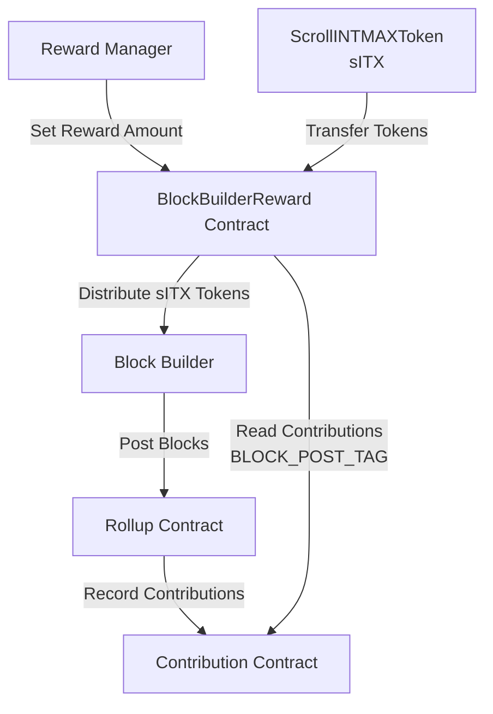
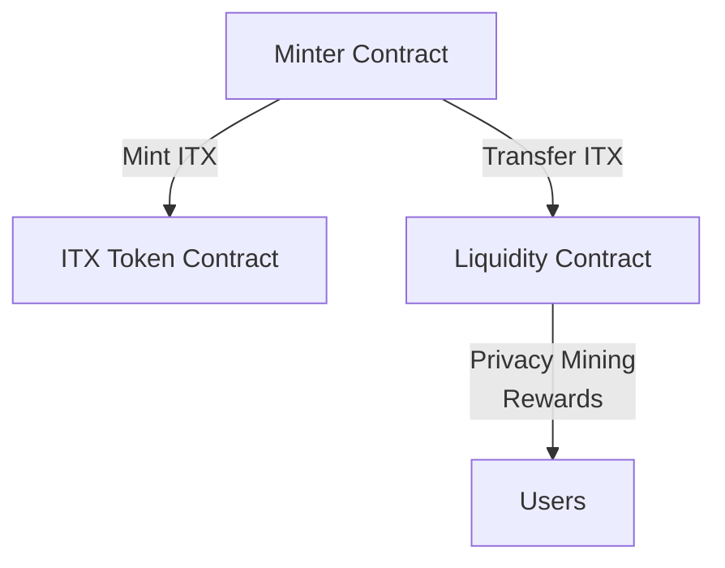

# INTMAX2 Reward Contract

This repository contains smart contracts for the INTMAX2 reward system, including token contracts and reward distribution mechanisms for block builders and privacy mining.

## Overview

The INTMAX2 reward system consists of three main components:

1. **Block Builder Reward System**: Distributes sITX tokens to block builders based on their contributions to the L2 network
2. **ScrollINTMAXToken (sITX)**: An ERC20 token deployed on Scroll network with transfer restrictions
3. **Minter**: Manages ITX token minting on mainnet and distribution to liquidity contracts for privacy mining rewards

## Architecture

### Scroll Network - Block Builder Reward System



### Ethereum Mainnet - Privacy Mining Rewards



### System Flow Overview

**Scroll Network (Block Builder Rewards):**

1. Block builders contribute to the L2 network by posting blocks to the Rollup Contract
2. The Rollup Contract records these contributions in the Contribution Contract with `BLOCK_POST_TAG`
3. Reward managers set total reward amounts for each period in the BlockBuilderReward Contract
4. The BlockBuilderReward Contract reads contribution data from the Contribution Contract
5. Block builders can claim their proportional share of sITX tokens based on their contributions

**Ethereum Mainnet (Privacy Mining):**

1. The Minter Contract mints ITX tokens from the mainnet ITX Token Contract
2. Minted ITX tokens are transferred to the Liquidity Contract
3. The Liquidity Contract distributes ITX tokens as privacy mining rewards to users

### Token Ecosystem

- **sITX (ScrollINTMAXToken)**: Reward token on Scroll network, initially non-transferable
- **ITX (INTMAXToken)**: Main token on Ethereum mainnet
- **Future Integration**: sITX tokens are planned to be exchangeable with mainnet ITX tokens (not yet implemented)

## Contracts

### ScrollINTMAXToken (sITX)

An ERC20 token implementation for INTMAX on the Scroll network with the following features:

**Key Features:**

- **Transfer Restrictions**: Transfers are disabled by default and can only be enabled by admin
- **Role-Based Access**: Uses `DISTRIBUTOR` role for privileged transfers even when transfers are disabled
- **Upgradeable**: Implements UUPS upgradeability pattern
- **Burn Functionality**: Token holders can burn their own tokens

**Roles:**

- `DEFAULT_ADMIN_ROLE`: Can enable transfers and authorize upgrades
- `DISTRIBUTOR`: Can transfer tokens even when transfers are disabled (typically the reward contract)

**Functions:**

- `initialize(admin, rewardContract, mintAmount)`: Initialize the contract with roles and initial supply
- `allowTransfers()`: Enable transfers for all users (irreversible)
- `burn(amount)`: Burn tokens from caller's account
- `supportsInterface(interfaceId)`: Check interface support

### BlockBuilderReward

A contract for managing and distributing rewards to block builders based on their contributions.

**Key Features:**

- **Period-Based Rewards**: Rewards are set and distributed per period
- **Proportional Distribution**: Rewards are distributed proportionally based on contribution scores
- **Contribution Integration**: Reads contribution data from the L2 Contribution contract using `BLOCK_POST_TAG`
- **Batch Operations**: Support for claiming multiple periods in a single transaction
- **Upgradeable**: Implements UUPS upgradeability pattern

**Roles:**

- `DEFAULT_ADMIN_ROLE`: Can authorize contract upgrades
- `REWARD_MANAGER_ROLE`: Can set reward amounts for periods

**Core Functions:**

- `setReward(periodNumber, amount)`: Set total reward amount for a specific period
- `claimReward(periodNumber)`: Claim rewards for a specific period
- `batchClaimReward(periodNumbers[])`: Claim rewards for multiple periods
- `getClaimableReward(periodNumber, user)`: Calculate claimable reward amount
- `getReward(periodNumber)`: Get reward information for a period
- `getCurrentPeriod()`: Get current period from Contribution contract

**Reward Calculation:**

```
userReward = (totalPeriodReward × userContribution) ÷ totalContributions
```

**States and Validations:**

- Periods must end before rewards can be claimed
- Rewards must be set by reward manager before claiming
- Users cannot claim the same period twice
- Zero total contributions prevent claiming

### Minter

A contract responsible for minting INTMAX tokens on mainnet and distributing them to liquidity contracts for privacy mining rewards.

**Key Features:**

- **Token Minting**: Mints ITX tokens from the mainnet INTMAX token contract
- **Liquidity Distribution**: Transfers minted tokens to designated liquidity address
- **Administrative Transfers**: Allows admin to transfer tokens to arbitrary addresses
- **Upgradeable**: Implements UUPS upgradeability pattern

**Roles:**

- `DEFAULT_ADMIN_ROLE`: Can authorize upgrades and transfer tokens to any address
- `TOKEN_MANAGER_ROLE`: Can mint tokens and transfer to liquidity

**Functions:**

- `mint()`: Mint new INTMAX tokens to this contract
- `transferToLiquidity(amount)`: Transfer tokens to the liquidity address
- `transferTo(to, amount)`: Transfer tokens to a specific address (admin only)

## Setup

### Prerequisites

Install Foundry:

```bash
curl -L https://foundry.paradigm.xyz | bash
foundryup
```

### Installation

1. Clone the repository:

```bash
git clone https://github.com/InternetMaximalism/intmax2-reward-contract.git
cd intmax2-reward-contract
```

2. Install dependencies:

```bash
forge install
```

3. Copy environment file:

```bash
cp .env.example .env
```

4. Configure environment variables in `.env`:

```bash
# Deployment
DEPLOYER_PRIVATE_KEY=your_private_key
ADMIN_ADDRESS=your_admin_address
REWARD_MANAGER_ADDRESS=your_reward_manager_address
CONTRIBUTION_CONTRACT_ADDRESS=your_contribution_contract_address
INITIAL_SUPPLY=1000000000000000000000000  # 1M tokens with 18 decimals

# RPC URLs
SCROLL_SEPOLIA_RPC_URL=https://sepolia-rpc.scroll.io
SCROLL_MAINNET_RPC_URL=https://rpc.scroll.io
ETHEREUM_MAINNET_RPC_URL=your_ethereum_rpc_url
```

### Compilation

```bash
forge compile
```

## Deployment

### Deploy All Contracts (Scroll Network)

Deploy both ScrollINTMAXToken and BlockBuilderReward contracts:

```bash
# Deploy to Scroll Sepolia
forge script script/DeployAll.s.sol --rpc-url scroll-sepolia --broadcast --verify

# Deploy to Scroll Mainnet
forge script script/DeployAll.s.sol --rpc-url scroll-mainnet --broadcast --verify
```

### Deploy Individual Contracts

Deploy ScrollINTMAXToken only:

```bash
forge script script/DeployScrollINTMAXToken.s.sol --rpc-url scroll-sepolia --broadcast --verify
```

Deploy BlockBuilderReward only:

```bash
forge script script/DeployBlockBuilderReward.s.sol --rpc-url scroll-sepolia --broadcast --verify
```

Deploy Minter (Ethereum Mainnet):

```bash
forge script script/DeployMinter.s.sol --rpc-url ethereum-mainnet --broadcast --verify
```

## Testing

Run all tests:

```bash
forge test
```

Run tests with verbose output:

```bash
forge test -vvv
```

Run specific test file:

```bash
forge test --match-path test/block-builder-reward/BlockBuilderReward.t.sol
```

Run tests with gas reporting:

```bash
forge test --gas-report
```

## Security Considerations

### Access Control

- All contracts use OpenZeppelin's AccessControl for role management
- Critical functions are protected by appropriate roles
- Upgrade authorization is restricted to admin roles

### Upgradeability

- Contracts use UUPS proxy pattern for upgradeability
- Only authorized admins can perform upgrades
- Implementation contracts have initializers disabled

### Transfer Restrictions

- sITX tokens have transfer restrictions by default
- Only distributors can transfer when restrictions are active
- Transfer enablement is irreversible

### Reward Distribution

- Rewards can only be claimed after periods end
- Double claiming is prevented
- Reward calculations use integer division (potential precision loss)

## License

This project is licensed under the MIT License - see the [LICENSE](LICENSE) file for details.
