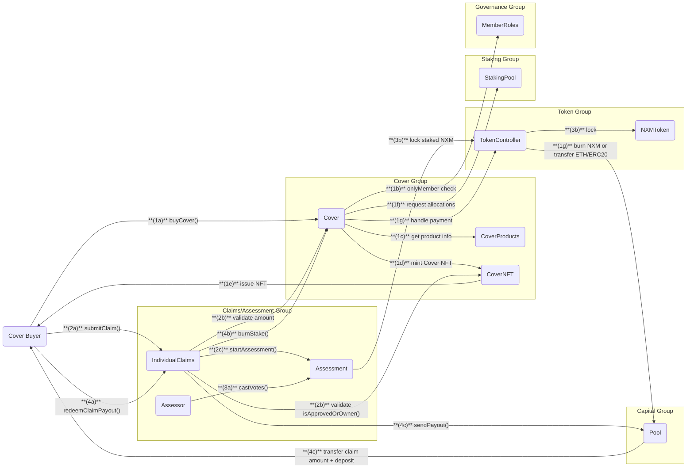
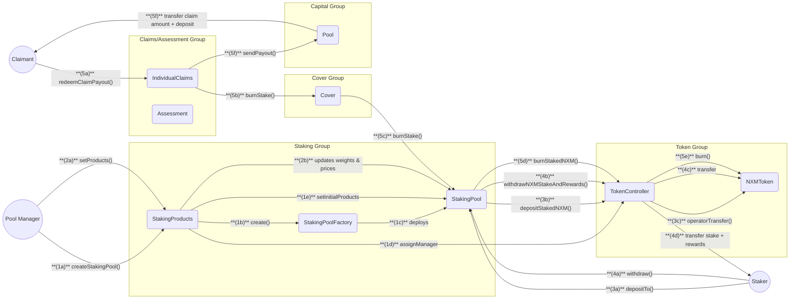

## Nexus Mutual Platform Flow Diagram

This document merges multiple **Cover** and **Staking** flows with their underlying interactions across **Token**, **Capital**, **Claims/Assessment**, and **Governance** groupings. We use two comprehensive flows:

1. Buying Cover and Processing Claims
   - Includes:
     - Buying Cover (**Cover ↔ Token ↔ Capital**)
     - Submitting and Assessing Claims (**Claims/Assessment ↔ Cover ↔ Capital ↔ Governance**)
2. Staking Pool Management and Staking Lifecycle
   - Includes:
     - Pool creation and product listing (**Staking ↔ Token**)
     - Stakers redeeming rewards (**Staking ↔ Token**)
     - Burning NXM on approved claims (**Claims/Assessment ↔ Staking ↔ Token**)

We provide detailed steps and a **Mermaid diagram** for each flow, ensuring step numbering in both the **text description** and **diagrams** for clarity. Code blocks are **escaped** so they remain valid raw markdown.

---

## Buying Cover & Processing Claims

```mermaid
flowchart LR
    %% Actors & Contracts
    Buyer("Cover Buyer")
    subgraph "Cover Group"
      CoverC("Cover")
      CoverP("CoverProducts")
      CoverN("CoverNFT")
    end

    subgraph "Token Group"
      TC("TokenController")
      NXM("NXMToken")
    end

    subgraph "Capital Group"
      PoolC("Pool")
    end

    subgraph "Staking Group"
      SP("StakingPool")
    end

    subgraph "Governance Group"
      MR("MemberRoles")
    end

    subgraph "Claims/Assessment Group"
      IndClaims("IndividualClaims")
      Assess("Assessment")
      Assessor("Assessor")
    end

    %% 1. Buy Cover (single tx)
    Buyer -->|"**(1a)** buyCover()"| CoverC
    CoverC -->|"**(1b)** onlyMember check"| MR
    CoverC -->|"**(1c)** get product info"| CoverP
    CoverC -->|"**(1d)** mint Cover NFT"| CoverN
    CoverN -->|"**(1e)** issue NFT"| Buyer
    CoverC -->|"**(1f)** request allocations"| SP
    CoverC -->|"**(1g)** handle payment"| TC
    TC -->|"**(1g)** burn NXM or transfer ETH/ERC20"| PoolC

    %% 2. Submit Claim (single tx)
    Buyer -->|"**(2a)** submitClaim()"| IndClaims
    IndClaims -->|"**(2b)** validate isApprovedOrOwner()"| CoverN
    IndClaims -->|"**(2b)** validate amount"| CoverC
    IndClaims -->|"**(2c)** startAssessment()"| Assess

    %% 3. Assessment Process (multiple tx)
    Assessor -->|"**(3a)** castVotes()"| Assess
    Assess -->|"**(3b)** lock staked NXM"| TC
    TC -->|"**(3b)** lock"| NXM

    %% 4. Claim Payout (single tx)
    Buyer -->|"**(4a)** redeemClaimPayout()"| IndClaims
    IndClaims -->|"**(4b)** burnStake()"| CoverC
    IndClaims -->|"**(4c)** sendPayout()"| PoolC
    PoolC -->|"**(4c)** transfer claim amount + deposit"| Buyer
```

### Step-by-Step

1. **Buyer Purchases Cover** 
   **(1a)** `Buyer` calls `buyCover(params, poolAllocationRequests)` on **Cover**. 
   **(1b)** `Cover` checks if buyer is a member via `onlyMember` modifier. 
   **(1c)** `Cover` gets product info from **CoverProducts**. 
   **(1d)** `Cover` mints NFT via **CoverNFT** if new cover. 
   **(1e)** `CoverNFT` issues NFT to buyer. 
   **(1f)** `Cover` requests allocations from **StakingPool**(s). 
   **(1g)** `Cover` handles payment: 
   - For NXM: Burns premium via **TokenController** 
   - For ETH/ERC20: Transfers premium to **Pool**

2. **Buyer Submits Claim** 
   **(2a)** `Buyer` calls `submitClaim()` on **IndividualClaims**. 
   **(2b)** `IndividualClaims` validates:

   - Cover ownership via `CoverNFT.isApprovedOrOwner()`
   - Cover validity via `Cover.coverSegmentWithRemainingAmount()`

   **(2c)** `IndividualClaims` starts assessment via `Assessment.startAssessment()`. 

3. **Claim Assessment** 
   **(3a)** `Assessors` call `castVotes()` on **Assessment**. 
   **(3b)** `Assessment` locks staked NXM via **TokenController**. 
   **(3c)** When voting ends: 

   - If accepted: Claim can be redeemed 
   - If denied: Claim deposit funds rewards 

4. **Claim Payout** 
   **(4a)** `Buyer` calls `redeemClaimPayout()` on **IndividualClaims**. 
   **(4b)** `IndividualClaims` calls `Cover.burnStake()` to burn staker's NXM. 
   **(4c)** `IndividualClaims` calls `Pool.sendPayout()` which: 
   - Transfers claim amount in cover asset 
   - Returns assessment deposit in ETH

---

## Staking Pool Management & Staking Lifecycle

```mermaid
flowchart LR
    %% Actors & Contracts
    Manager(("Pool Manager"))
    Staker(("Staker"))
    Claimant(("Claimant"))


    subgraph "Staking Group"
      SPF("StakingPoolFactory")
      SP("StakingPool")
      SPd("StakingProducts")
    end

    subgraph "Token Group"
      TCO("TokenController")
      NXM("NXMToken")
    end

    subgraph "Claims/Assessment Group"
      IC("IndividualClaims")
      AS("Assessment")
    end

    subgraph "Cover Group"
      CoverC("Cover")
    end

    subgraph "Capital Group"
      PoolC("Pool")
    end

    %% 1. Create Pool (single tx)
    Manager -->|"**(1a)** createStakingPool()"| SPd
    SPd -->|"**(1b)** create()"| SPF
    SPF -->|"**(1c)** deploys"| SP
    SPd -->|"**(1d)** assignManager"| TCO
    SPd -->|"**(1e)** setInitialProducts"| SP

    %% 2. Update Products (single tx)
    Manager -->|"**(2a)** setProducts()"| SPd
    SPd -->|"**(2b)** updates weights & prices"| SP

    %% 3. Deposit NXM (single tx)
    Staker -->|"**(3a)** depositTo()"| SP
    SP -->|"**(3b)** depositStakedNXM()"| TCO
    TCO -->|"**(3c)** operatorTransfer()"| NXM

    %% 4. Withdraw (single tx)
    Staker -->|"**(4a)** withdraw()"| SP
    SP -->|"**(4b)** withdrawNXMStakeAndRewards()"| TCO
    TCO -->|"**(4c)** transfer"| NXM
    TCO -->|"**(4d)** transfer stake + rewards"| Staker

    %% 5. Burn and Payout on Claim (single tx)
    Claimant -->|"**(5a)** redeemClaimPayout()"| IC
    IC -->|"**(5b)** burnStake()"| CoverC
    CoverC -->|"**(5c)** burnStake()"| SP
    SP -->|"**(5d)** burnStakedNXM()"| TCO
    TCO -->|"**(5e)** burn()"| NXM
    IC -->|"**(5f)** sendPayout()"| PoolC
    PoolC -->|"**(5f)** transfer claim amount + deposit"| Claimant
```

### Step-by-Step

1. **Pool Manager Creates a New Staking Pool** 
   **(1a)** `Manager` calls `"createStakingPool()"` on **StakingProducts**. 
   **(1b)** `StakingProducts` calls `"create()"` on **StakingPoolFactory**. 
   **(1c)** `StakingPoolFactory` deploys new **StakingPool**. 
   **(1d)** `StakingProducts` assigns manager via **TokenController**. 
   **(1e)** `StakingProducts` sets initial products and metadata. 
2. **Manager Updates Pool Products** 
   **(2a)** `Manager` calls `"setProducts()"` on **StakingProducts**. 
   **(2b)** `StakingProducts` updates weights and prices in **StakingPool**. 
3. **Staker Deposits NXM** 
   **(3a)** `Staker` calls `"depositTo(amount, trancheId, tokenId, dest)"` on **StakingPool**. 
   **(3b)** `StakingPool` validates and calculates shares, calls `"depositStakedNXM()"` on **TokenController**. 
   **(3c)** `TokenController` updates pool balance and calls `"operatorTransfer()"` on **NXMToken**. 
4. **Staker Withdraws Stake/Rewards** 
   **(4a)** `Staker` calls `"withdraw()"` on **StakingPool**. 

   - _Optional_: Check withdrawable amounts first via **NexusViewer** (`"getClaimableNXM()"`, `"getStakedNXM()"`) 

   **(4b)** `StakingPool` calculates amounts, calls `"withdrawNXMStakeAndRewards()"` on **TokenController**. 
   **(4c)** `TokenController` calls transfers on **NXMToken**. 
   **(4d)** `NXMToken` transfer stake + rewards to **Staker** 
5. **Claim Redemption Burns Stake and Pays Claimant** 
   If a claim is approved the claimant is paid from the staked NXM. 
   **(5a)** `Claimant` calls `"redeemClaimPayout()"` on **IndividualClaims**. 
   **(5b)** `IndividualClaims` calls `"burnStake()"` on **Cover**. 
   **(5c)** `Cover` calls `"burnStake()"` on affected **StakingPool**(s). 
   **(5d)** `StakingPool` calls `"burnStakedNXM()"` on **TokenController**. 
   **(5e)** `TokenController` burns tokens via **NXMToken**. 
   **(5f)** `IndividualClaims` calls `"Pool.sendPayout()"` which: 
   - Transfers claim amount in cover asset 
   - Returns assessment deposit in ETH
