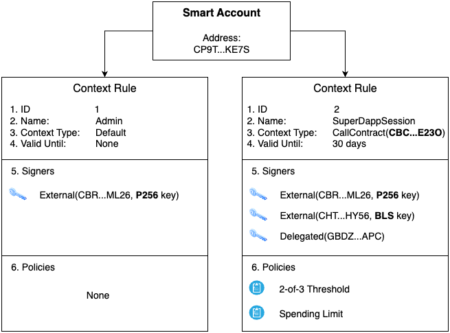
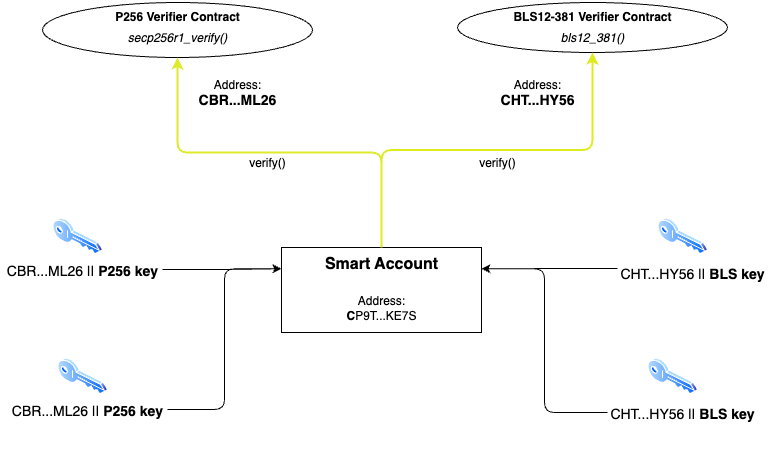

# Soroban Smart Accounts

This package provides a comprehensive smart account framework for Soroban, enabling flexible, programmable authorization. Instead of hard‑coding signature checks, smart accounts organize authorization as a composition of context rules, signers, and policies. The result is a system that reads naturally, scales to complex requirements, and remains auditable.

## Overview

Smart accounts in Soroban implement `CustomAccountInterface` and define authorization as data and behavior that can be evolved over time. The framework is context‑centric:

It separates authentication (signers prove identity), authorization scope (context rules bind signers and policies to specific operations), and enforcement logic (policies apply business constraints like spending limits or thresholds). Under the hood, Protocol 23 improvements make this design practical, with marginal storage read costs and substantially cheaper cross‑contract calls, so composing multiple checks is efficient enough for production.

In practical terms, a smart account is a contract that manages the composition of authorization intents coming from multiple sources. Those sources can be policies (for example, a spending limit) and signing keys that may use different cryptographic curves. The goal is to enable flexible combinations of authentication methods by allowing several authorization mechanisms to work together seamlessly. For instance, a wallet might require both a session policy and a passkey that expires in 24 hours, and treat this combination as a single composite “key” that the client uses to authorize actions.

## Core Components



### 1. Smart Account Trait

The `SmartAccount` trait extends `CustomAccountInterface` from `soroban_sdk` with context rule management capabilities:

```rust
pub trait SmartAccount: CustomAccountInterface {
    fn get_context_rule(e: &Env, context_rule_id: u32) -> ContextRule;
    fn get_context_rules_count(e: &Env) -> u32;
    fn add_context_rule(/* ... */) -> ContextRule;
    fn update_context_rule_name(/* ... */) -> ContextRule;
    fn update_context_rule_valid_until(/* ... */) -> ContextRule;
    fn remove_context_rule(e: &Env, context_rule_id: u32);
    fn add_signer(e: &Env, context_rule_id: u32, signer: Signer);
    fn remove_signer(e: &Env, context_rule_id: u32, signer_id: u32);
    fn add_policy(e: &Env, context_rule_id: u32, policy: Address, install_param: Val);
    fn remove_policy(e: &Env, context_rule_id: u32, policy_id: u32);
}
```

### 2. Context Rules

Context rules function like routing tables for authorization: for each `Context`, they specify scope, lifetime, and the conditions, signers and policies, that must match before execution proceeds.

#### Structure

- **ID**: Unique identifier
- **Name**: Human-readable description
- **Context Type**: Scope of the rule
  - `Default`: Applies to any context
  - `CallContract(Address)`: Specific contract calls
  - `CreateContract(BytesN<32>)`: Contract deployments
- **Valid Until**: Optional expiration (ledger sequence)
- **Signers**: List of authorized signers (max: 15)
- **Policies**: Map of policy contracts and their parameters (max: 5)

A single smart account can hold any number of context rules. There is no upper limit on the number of context rules per account.

#### Key Properties

- Each rule must contain at least one signer OR one policy
- Multiple rules can exist for the same context type
- Expired rules are rejected at authorization time

#### `soroban_sdk::auth::Context` and `ContextRule`

`soroban_sdk::auth::Context` is a Soroban SDK type representing a single authorized operation within a transaction. When `__check_auth` is invoked, the runtime passes `auth_contexts: Vec<Context>` — one entry per `require_auth` call in the transaction. Each variant captures the operation details:

- `Contract(ContractContext)` — a contract function call, carrying the `contract` address, `fn_name`, and `args`
- `CreateContractHostFn(CreateContractHostFnContext)` — a contract deployment without constructor arguments, carrying `executable` (WASM hash) and `salt`
- `CreateContractWithCtorHostFn(CreateContractWithConstructorHostFnContext)` — a contract deployment with constructor arguments

A `ContextRule` is this library's concept: a stored authorization requirements entry that lives in the smart account's own storage. A `ContextRule` is bound to a `ContextRuleType` that narrows which `Context` variants it can authorize. A smart account can hold **any number of `ContextRule`s covering the same context type** — for example, an admin rule and a time-limited session rule can both be scoped to `CallContract(dex_address)`.

During authorization the caller must supply **exactly one `ContextRule` ID per `Context`** in `AuthPayload::context_rule_ids`. The caller explicitly selects which stored rule to validate against for each operation.

### 3. Signers

Signers define who can authorize operations. There are two variants:

#### Delegated Signers

```rust
Signer::Delegated(Address)
```

- Any Soroban address (contract or account)
- Verification uses `require_auth_for_args(payload)`
- This model requires manual authorization entry crafting, because it is not returned in a simulation mode.

#### External Signers

```rust
Signer::External(Address, Bytes)
```
- External verifier contract + public key data
- Offloads signature verification to specialized contracts
This model scales to diverse cryptographic schemes, is flexible enough to accommodate new authentication methods (from passkeys to zk-proofs), and minimizes setup cost by allowing many accounts to reuse the same verifier contracts.



### 4. Verifiers

Verifiers serve as cryptographic oracles for signature validation: specialized, trusted contracts that validate signatures on behalf of smart accounts. Drawing inspiration from EIP‑7913, a single verifier contract can validate signatures for any number of keys. Each key is represented as a `(verifier_address, public_key)` pair (ref. the section above), where the verifier address points to shared verification logic and the public key identifies the specific signer.

This architecture offers several advantages. Once a verifier is deployed, new keys can be used immediately without any on‑chain setup or deployment expenses. The model supports diverse cryptographic schemes: secp256r1 for mobile devices, secp256k1, ed25519, BLS, and RSA for institutional keys, as well as emerging authentication methods like zero‑knowledge proofs and email‑based signing. Keys remain address‑less, maintaining clear boundaries between accounts (which hold assets) and the keys that control them. Because verification logic is centralized in well‑audited, immutable contracts, the ecosystem shares both security guarantees and deployment costs. Well‑known verifier addresses build trust, and the entire network benefits from reduced overhead.

Verifiers should be implemented as pure verification functions with no internal state and shouldn't be upgradeable once deployed, ensuring trustlessness.

```rust
pub trait Verifier {
    type KeyData: FromVal<Env, Val>;
    type SigData: FromVal<Env, Val>;

    fn verify(e: &Env, hash: Bytes, key_data: Self::KeyData, sig_data: Self::SigData) -> bool;
}
```

### 5. Policies

Policies act as enforcement modules attached to context rules: they validate authorization requirements and, when authorized, can update state to enforce limits or workflows.

```rust
pub trait Policy {
    type AccountParams: FromVal<Env, Val>;

    // Validate authorization and apply any state changes
    fn enforce(/* ... */);

    // Initialize policy-specific storage and configuration
    fn install(/* ... */);

    // Clean up policy data for an account and context rule
    fn uninstall(/* ... */);
}
```

#### Lifecycle

Policies follow a well-defined lifecycle that integrates with context rule management and authorization.

**Installation** occurs when a new context rule is created with attached policies. The smart account calls `install()` on each policy contract, passing account-specific and context-specific parameters. This initialization step allows policies to configure their logic (for example, a threshold policy might define the required number of signatures for that particular account and context rule, while a spending limit policy might set daily or per-transaction caps). Installation ensures that each policy has the necessary state and configuration ready before authorization checks begin.

**Enforcement** is triggered when a context rule is validated. The smart account calls `enforce()` on each policy in the matched rule. This hook validates authorization requirements (for example, that enough signers are present or that a spending limit is not exceeded) and applies any necessary state changes (for example, updating counters or emitting events). If a policy rejects the authorization attempt, the transaction is reverted.

**Uninstallation** occurs when a context rule is removed from the smart account. The account calls `uninstall()` on each attached policy, allowing them to clean up any stored data associated with that specific account and context rule pairing. This ensures that policies do not leave orphaned state in storage.

#### Policy Examples

- Admin Access: Elevated permissions for account management
- Spending Limits: Time-based or token-based restrictions
- Multisig: Threshold-based authorization
- Session Policies: Temporary, scoped permissions
- Recovery Policies: Account recovery mechanisms

#### Caveats

**Signer Set Divergence in Threshold Policies**

Threshold policies (both simple and weighted) store authorization requirements that are validated at installation time. However, policies are not automatically notified when signers are added to or removed from their parent context rule. This creates a state divergence that can lead to operational issues.

If signers are removed after policy installation, the total available signatures or weight may fall below the stored threshold, making it impossible to meet the authorization requirement and permanently blocking actions governed by that policy. For example, a 5-of-5 multisig where two signers are removed leaves only three signers, making the threshold of five unreachable.

Conversely, if signers are added without updating the threshold, the security guarantee silently weakens. A strict 3-of-3 multisig becomes a 3-of-5 multisig after adding two signers, reducing the required approval from 100% to 60% without any explicit warning.

Administrators must manually update thresholds and weights when modifying signer sets. Before removing signers, verify that the threshold remains achievable. After adding signers, adjust thresholds or assign weights to maintain the desired security level. Ideally, these updates should occur in the same transaction as the signer modifications.

**`enforce()` Responsibilities**

The `enforce()` function handles both validation and state mutation in a single step. It must reject invalid authorization by panicking (which reverts the transaction), and apply any necessary state changes (for example, decrementing a spending allowance or incrementing a counter). Because it runs after signature authentication and context type matching are already confirmed, the focus inside `enforce()` is on business-logic constraints.

### 6. Execution Entry Point

The `ExecutionEntryPoint` trait enables secure contract-to-contract calls:

```rust
pub trait ExecutionEntryPoint {
    fn execute(e: &Env, target: Address, target_fn: Symbol, target_args: Vec<Val>);
}
```

This trait provides a secure mechanism for updating policy configuration after installation. As noted in the caveats above, administrators must manually adjust thresholds and weights when modifying signer sets. The execution entry point allows the smart account to call policy update functions (such as `set_threshold()` or `set_signer_weight()`) in a controlled manner, ensuring that configuration changes are properly authorized by the account itself. This enables administrators to maintain security invariants when adding or removing signers, ideally bundling signer modifications and threshold adjustments into a single authorized transaction.

## Authorization Flow

Authorization is determined by explicitly selecting the rule to validate against for each auth context. The caller specifies rule IDs in the `AuthPayload` struct, one per auth context. No rule iteration or auto-discovery is performed.

### 1. Signature Authentication

All provided signatures are authenticated up front:
- `Delegated` signers use `require_auth_for_args(payload)`.
- `External` signers are verified through their verifier contract.

### 2. Per-Context Validation

For each (auth context, rule ID) pair:

1. **Rule Lookup**: Retrieve the rule by ID; reject if it does not exist.
2. **Expiration Check**: Reject if the rule’s `valid_until` is in the past.
3. **Context Type Check**: Reject if the rule’s context type does not match the actual context (`Default` matches any context).
4. **Signer Filtering**: Identify which rule signers are authenticated.
5. **Signer Requirement**: Without policies, all rule signers must be authenticated. With policies, full signer validation is deferred to `enforce()`.

### 3. Policy Enforcement

After all contexts are validated, `enforce()` is called on every policy in every matched rule. Policies validate authorization requirements (for example, threshold counts or spending limits) and apply any state changes. If a policy rejects, the transaction reverts.

### 4. Result

- **Success**: Authorization granted, transaction proceeds.
- **Failure**: Authorization denied, transaction reverts.

### Constructing `AuthPayload`

`Vec<context_rule_ids>` must have the same length as `Vec<Context>`, a mismatch is rejected with `ContextRuleIdsLengthMismatch`.

```rust
// One rule ID per auth context.
AuthPayload {
    signers: signature_map,
    context_rule_ids: vec![&e, rule_a_id, rule_b_id],
}
```

Each rule must:
- Exist (not have been removed).
- Not be expired.
- Have a context type compatible with its corresponding auth context (`Default` matches any context).
- Have its signer and policy requirements satisfied.

#### Example

Consider a call in the `CallContract(dex_address)` context. The client presents an ed25519 key and a passkey signature. The smart account has a `CallContract(dex_address)` rule requiring both signers and a daily spending limit policy. The client sets `context_rule_ids = [rule_id]`. The account authenticates both keys, validates the rule, and then calls the spending limit policy’s `enforce()`, which checks the limit and updates counters. Authorization succeeds.

## Use Cases

### 1. Session Logins (Web3 dApps)

```rust,ignore
// Create a session policy for a DeFi app
create_context_rule(
    context_type: CallContract(defi_app_address),
    name: "DeFi Session",
    valid_until: Some(current_ledger + 24_hours),
    signers: vec![&e, ed25519_key],
    policies: map![&e, (spending_limit_policy, spending_params)]
)
```

### 2. Backend Automation

```rust
// Recurring payment authorization
create_context_rule(
    context_type: CallContract(payment_processor),
    name: "Monthly Subscription",
    valid_until: None,
    signers: vec![&e, automation_key],
    policies: map![
        &e,
        (frequency_policy, monthly_params),
        (amount_policy, max_50_dollars)
    ]
)
```

### 3. AI Agents

```rust
// Controlled AI agent access
create_context_rule(
    context_type: Default,
    name: "Portfolio AI",
    valid_until: Some(current_ledger + 7_days),
    signers: vec![&e, ai_agent_key],
    policies: map![
        &e,
        (whitelist_policy, allowed_functions),
        (balance_policy, max_percentage)
    ]
)
```

### 4. Multisig

```rust
// Complex multisig with mixed signer types
create_context_rule(
    context_type: Default,
    name: "Treasury Operations",
    valid_until: None,
    signers: vec![
        &e,
        Signer::External(ed25519_verifier, alice_pubkey),
        Signer::External(secp256k1_verifier, bob_pubkey),
        Signer::Delegated(carol_contract)
    ],
    policies: map![&e, (threshold_policy, two_of_three)]
)
```

## Getting Started

### 1. Installation

Add this to your `Cargo.toml`:

```toml
[dependencies]
# We recommend pinning to a specific version, because rapid iterations are expected as the library is in an active development phase.
stellar-accounts = "=0.6.0"
```

### 2. Implement the Smart Account Trait

```rust
use stellar_accounts::smart_account::{
    add_context_rule, do_check_auth, ContextRule, ContextRuleType,
    AuthPayload, Signer, SmartAccount, SmartAccountError,
};
#[contract]
pub struct MySmartAccount;

#[contractimpl]
impl SmartAccount for MySmartAccount {
    fn add_context_rule(
        e: &Env,
        context_type: ContextRuleType,
        name: String,
        valid_until: Option<u32>,
        signers: Vec<Signer>,
        policies: Map<Address, Val>,
    ) -> ContextRule {
        e.current_contract_address().require_auth();

        add_context_rule(e, &context_type, &name, valid_until, &signers, &policies)
    }
    // Implement all other methods
}

#[contractimpl]
impl CustomAccountInterface for MySmartAccount {
    type Signature = AuthPayload;

    fn __check_auth(
        e: Env,
        signature_payload: Hash<32>,
        signatures: AuthPayload,
        auth_contexts: Vec<Context>,
    ) -> Result<(), SmartAccountError> {
        do_check_auth(&e, &signature_payload, &signatures, &auth_contexts)
    }
}
```

#### Constructing `AuthPayload`

Build the `AuthPayload` value in the client (SDK/wallet) before submitting the transaction. Always provide one rule ID per auth context:

```rust
// One rule ID per auth context — always required.
let signatures = AuthPayload {
    signers: signature_map,
    context_rule_ids: vec![&e, rule_a_id, rule_b_id],
};
```

### 3. Create Context Rules

```rust
// Create an admin rule
add_context_rule(
    &e,
    ContextRuleType::Default,
    String::from_str(&e, "Admin Access"),
    None, // No expiration
    vec![&e, admin_signer],
    map![&e]
);
```

### 4. Add Policies (Optional)

For policies, there are two options:

**Option A: Use Ecosystem Policies (Recommended)**
- Use pre-deployed, audited policy contracts for common use cases that are trusted by the ecosystem and cover standard scenarios
- Examples: Simple threshold, weighted threshold, spending limits, time-based restrictions

**Option B: Create Custom Policies**
- Implement your own policy contracts by implementing the `Policy` trait
- Useful for specialized business logic or unique authorization requirements

```rust
// Add a spending limit policy
add_policy(
    &e,
    admin_rule.id,
    spending_policy_address,
    spending_limit_params
);
```

### 5. Choose or Deploy Verifier Contracts (For External Signers)

For external signers, there are two options:

**Option A: Use Ecosystem Verifiers (Recommended)**

- Use pre-deployed, audited verifier contracts for common signature schemes
- These are trusted by the ecosystem and are immediately available
- Examples: Standard ed25519, secp256k1, secp256r1, bls12-381 verifiers

**Option B: Deploy Custom Verifiers**

- Deploy your own verifier contracts for application-specific requirements
- Useful for custom cryptographic schemes or specialized verification logic
- Requires thorough security auditing and testing

## Caveats

- Multiple context rules for the same context can co‑exist. The caller selects which rule to validate against by specifying rule IDs in `context_rule_ids`. Remove outdated permissive rules when they are no longer needed.
- For simple cases like threshold‑based multisig, using a policy may feel verbose compared to embedding logic directly in the account, but keeping business rules in policies preserves separation of concerns and allows for a greater flexibility.
- Authorization composes independent contracts (the smart account, verifiers, and policies). Protocol 23 makes cross‑contract calls cheap, but not free, so the framework sets explicit limits to keep per-rule costs predictable:
  - Maximum signers per context rule: 15
  - Maximum policies per context rule: 5
- Signers and policies are stored in a global registry and deduplicated across rules. The same signer object (identified by its XDR encoding) is stored once regardless of how many rules reference it. Each signer and policy is assigned a stable `u32` ID that is used when removing them from a rule (`remove_signer`, `remove_policy`).

## Migration Guide: from v0.6.0 to 0.7.0

### `AuthPayload` struct (breaking change)

`AuthPayload` changed from a tuple struct to a named-field struct:

```rust
// Before
pub struct AuthPayload(pub Map<Signer, Bytes>);

// After
pub struct AuthPayload {
    pub signers: Map<Signer, Bytes>,
    pub context_rule_ids: Vec<u32>,  // required: one ID per auth context
}
```

This changes the XDR encoding. A tuple struct is serialized as `ScVal::Vec`, while a named struct is serialized as `ScVal::Map` with `Symbol` keys.

#### XDR / off-chain clients (JS SDK, CLI tools, etc.)

The `signature` field in `SorobanAddressCredentials` must change from a single-element `ScVal::Vec` wrapping the signer map to an `ScVal::Map` with two `Symbol`-keyed entries, always including the rule IDs:

```rust
// Before — tuple struct encoding
ScVal::Vec([
    ScVal::Map(/* signer -> signature entries */)
])

// After — named struct encoding with rule IDs (one per auth context)
ScVal::Map([
    (Symbol("context_rule_ids"), ScVal::Vec(/* rule IDs, one per auth context */)),
    (Symbol("signers"),          ScVal::Map(/* signer → signature entries */)),
])
```

Concrete example (with the `stellar_xdr` crate):

```rust
// Before
let sig_map = ScVal::Map(Some(ScMap::sorted_from(signatures)?));
creds.signature = ScVal::Vec(Some(ScVec(VecM::try_from([sig_map])?)));

// After — one rule ID per auth context, always required
creds.signature = ScVal::Map(Some(ScMap::sorted_from([
    (
        ScVal::Symbol("context_rule_ids".try_into()?),
        ScVal::Vec(Some(ScVec(VecM::try_from([
            ScVal::U32(rule_id_for_context_0),
            ScVal::U32(rule_id_for_context_1),
        ])?))),
    ),
    (
        ScVal::Symbol("signers".try_into()?),
        sig_map,
    ),
])?));
```

### `Policy` trait (breaking change)

The `can_enforce()` method has been removed. The `enforce()` method is now responsible for both validation and state changes:

```rust
// Before
pub trait Policy {
    fn can_enforce(/* ... */) -> bool;
    fn enforce(/* ... */);
    fn install(/* ... */);
    fn uninstall(/* ... */);
}

// After — can_enforce removed
pub trait Policy {
    fn enforce(/* ... */);  // validates and applies state changes
    fn install(/* ... */);
    fn uninstall(/* ... */);
}
```

Remove `can_enforce` from all policy contract implementations.

### Iteration removed (behavioral change)

The automatic newest-first rule iteration path has been removed. The `context_rule_ids` field in `AuthPayload` is now mandatory. Every client must explicitly supply the rule ID to validate against for each auth context.

### `get_context_rules` removed (breaking change)

The deprecated `get_context_rules` method that returned a `Vec<ContextRule>` has been removed. Use `get_context_rule` to fetch individual rules by their ID and `get_context_rules_count` to know how many rules exist.

### `TooManyContextRules` replaced by `MathOverflow` (breaking change)

The `TooManyContextRules = 3012` error has been renamed to `MathOverflow = 3012`. There is no longer an upper limit on the number of context rules per smart account. Error code 3012 is now emitted when an internal ID counter (`NextId`, `NextSignerId`, or `NextPolicyId`) reaches `u32::MAX` and cannot be incremented further.

### `remove_signer` and `remove_policy` now take IDs (breaking change)

`remove_signer` now takes a `signer_id: u32` instead of a full `Signer` object. `remove_policy` now takes a `policy_id: u32` instead of an `Address`. IDs are emitted in events when signers and policies are added:

- `context_rule_added` event data includes `signer_ids: Vec<u32>` and `policy_ids: Vec<u32>`
- `signer_added` event data includes `signer_id: u32`
- `policy_added` event data includes `policy_id: u32`

### Global signer and policy registry (behavioral change)

Signers and policies are now stored in a global registry and deduplicated across context rules. The same signer (identified by its XDR encoding) or policy address is stored once regardless of how many rules reference it. A reference count is maintained; storage is cleaned up automatically when the count reaches zero. This reduces storage usage when signers or policies are shared across multiple rules.

## Crate Structure

This crate is organized into three submodules that provide building blocks for implementing smart accounts. These submodules can be used independently or together, allowing developers to implement only the components they need, create custom smart account architectures, mix and match different authentication methods, and build specialized authorization policies.

1. **smart_account**
- context rule management, signer/policy storage functions for implementing the `SmartAccount` trait

2. **verifiers**
- `ed25519` and `webauthn` (passkey authentication) utility functions for implementing the `Verifier` trait

3. **policies**
- `simple_threshold`, `weighted_threshold` and `spending_limit` utility functions for implementing the `Policy` trait

