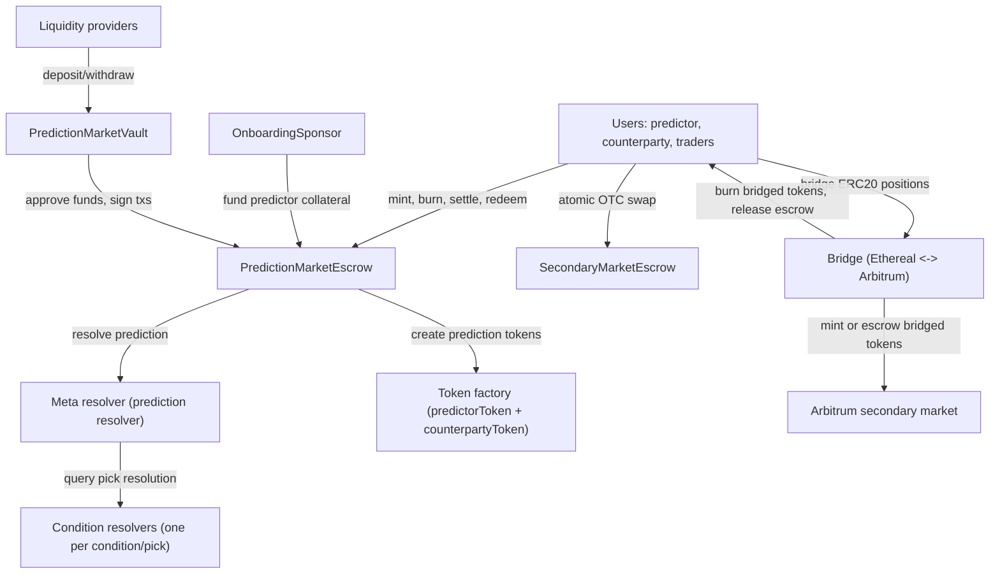
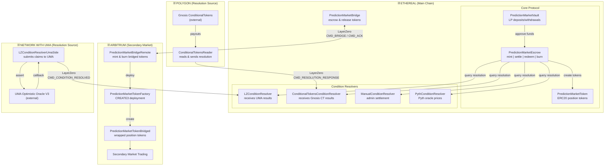

# PredictionMarket Protocol Spec

## Terms
- Condition: Question to be responded (will x team win?)
- Condition resolver: contract that is the source of truth for the resolution of ONE condition.
- Prediction: collection of one or more picks.
- Meta resolver (prediction resolver): contract that resolves a prediction by querying the per-pick condition resolvers and applying prediction logic.
- conditionId: opaque bytes32 identifier, resolver-defined (the protocol is agnostic to how it’s derived).
- Pick: (conditionResolver, conditionId, predictedOutcomeSide)
- Outcome vector: resolution output of the form \[yesWeight, noWeight\] (see Condition resolution below).
- Predictor: player that creates the prediction (long / “for” side)
- PredictorCollateral: amount paid by the predictor on that prediction
- Counterparty: player that takes the other side of the prediction (short / “against” side)
- CounterpartyCollateral: amount paid by the counterparty

## Requirements and specs

### Main changes in V2 (vs current V1-style boolean resolver + NFT position)
- Each pick can have its own condition resolver, and a separate meta resolver resolves the overall prediction.
- Resolvers return an outcome vector \[yesWeight, noWeight\] instead of a boolean.
- Positions are represented by a pair of ERC20s (predictor token + counterparty token) per prediction, to enable partial transfers and secondary markets.

### Condition resolution
- Condition resolution is done by a condition resolver contract.
- Resolution uses a vector of two integer values: \[yesWeight, noWeight\]
- Interpretation: \(P(YES) = yesWeight / (yesWeight + noWeight)\) and \(P(NO) = noWeight / (yesWeight + noWeight)\)
- Usual case is decisive YES/NO. Non-decisive vectors (e.g. ties) are supported even if not expected from initial resolvers.
- A non-decisive outcome (anything other than pure [1,0] or [0,1]) counts against the predictor at the prediction level.
- Examples:
  - condition resolved to YES, resulting vector is [1,0]
  - condition resolved to NO, resulting vector is [0,1]
  - non-decisive (e.g. tie), resulting vector is [1,1]. At the prediction level this results in the counterparty winning.

### Pick encoding (high level)
- The protocol should treat `conditionId` as an opaque `bytes32` value whose meaning and encoding/decoding is defined by the `conditionResolver`.
- Collision resistance:
  - `conditionId` only needs to be unique within a resolver; the pair (resolverAddress, conditionId) forms a namespace.
  - Given that picks are always associated with a resolver address, there is no practical collision risk across different resolvers.
- Recommended pick fields:
  - `conditionResolver` (address)
  - `conditionId` (bytes32)
  - `predictedOutcomeSide` (enum: YES / NO / TIE (optional))
- Canonicalization recommendation (so the “same prediction” hashes/serializes identically):
  - Disallow duplicate picks (same resolver + conditionId repeated).
  - Either require picks to be provided in a canonical order (e.g. sort by (resolver, conditionId, predictedOutcomeSide)), or have the meta resolver enforce canonical ordering before hashing.
  - Use an unambiguous encoding for the list of picks (e.g. ABI-encoding an array of structs) rather than concatenating variable-length blobs.

### Prediction resolution
- Prediction resolution is performed by the meta resolver.
- A prediction resolves in favor of either predictor or counterparty.
- Prediction semantics:
  - If ALL picks resolve decisively and match the predicted outcomes, the winner is the predictor
  - If ANY pick resolves decisively against the predicted outcomes, the winner is the counterparty
  - If ANY pick is non-decisive (i.e. not a pure \[1,0] or \[0,1]), the counterparty wins
- Payout:
  - Winner takes PredictorCollateral + CounterpartyCollateral
  - The predictor must get every pick right to win; any loss or indecisive result means the counterparty wins

### Resolver
- Condition resolver: external contract that resolves a single condition to an outcome vector.
- Meta resolver: resolves a prediction by checking each pick against its condition resolver and applying prediction semantics.
- As mentioned in picks definition, a single prediction can contain different condition resolvers, one per pick.

### Fungible Prediction Pools

The V2 protocol uses fungible prediction pools where users with the same picks share tokens:

#### Two-Level ID System
| ID | Formula | Purpose |
|---|---------|---------|
| `pickConfigId` | `keccak256(picks)` | Identifies the fungible token pair (reusable across predictions with same picks) |
| `predictionId` | `keccak256(pickConfigId, predictor, counterparty, nonce)` | Identifies individual prediction (unique per mint, for audit trail) |

#### Token Minting: Both Sides Receive totalCollateral Tokens (C-1)
- On each mint, both predictor and counterparty receive `totalCollateral = predictorCollateral + counterpartyCollateral` tokens
- This bakes the odds into the token amount, making tokens fungible regardless of the odds at which each prediction was placed
- Tokens represent shares of the collateral pool; redemption pays `(tokenAmount / originalTotalTokensMinted) * claimablePool`
- Multiple users with same picks share the same token

#### Parimutuel Model Example
```
PickConfig for [BTC > 100k]:

Prediction 1: User A (predictor, 50) vs User C (counterparty, 40)
  totalCollateral = 90
  A receives 90 predictor tokens, C receives 90 counterparty tokens

Prediction 2: User B (predictor, 30) vs User D (counterparty, 60)
  totalCollateral = 90
  B receives 90 predictor tokens, D receives 90 counterparty tokens

Pool totals:
  Total predictor tokens minted: 180
  Total counterparty tokens minted: 180
  Total predictor collateral: 80 (50 + 30)
  Total counterparty collateral: 100 (40 + 60)
  Total collateral: 180 USDE

If BTC > 100k (predictor wins):
  claimablePool = 180 USDE (all collateral goes to predictor side)
  User A redeems 90/180 * 180 = 90 USDE (deposited 50, profit 40)
  User B redeems 90/180 * 180 = 90 USDE (deposited 30, profit 60)
  User C and D get 0

If BTC < 100k (counterparty wins):
  claimablePool = 180 USDE (all collateral goes to counterparty side)
  User C redeems 90/180 * 180 = 90 USDE (deposited 40, profit 50)
  User D redeems 90/180 * 180 = 90 USDE (deposited 60, profit 30)
  User A and B get 0

Note: User B got better odds (1:3 vs A's 5:4) and thus more profit per
USDE deposited. The token amounts encode these odds automatically.
```

### Integration
- The system mints a pair of fungible ERC20s per pick configuration (not per prediction)
- Multiple predictions with the same picks share the same token pair
- There's a generic bridge that will be used to bridge the ERC20s to Arbitrum for secondary market trading.
- Uses CREATE3 for deterministic token addresses across chains

### Collateral
- Both collateral amounts are deposited in ethereal.
- Collateral is WUSDe. 
- Note: If we want to use native USDe, we should include some kind of escrow of counterpartyCollateral due to the async mint process

### Mint
- Mint accepts EOA signatures, EIP-1271 (smart contract wallets), and session key signatures
- Optional predictor sponsorship via `IMintSponsor` interface (e.g. OnboardingSponsor for onboarding flows)
- Optional referral code (`refCode`) for tracking

#### Session Key Verification
- Session keys require owner signature proving authorization (EIP-712 `SessionKeyApproval`)
- Smart account verification via `IAccountFactory.getAccountAddress(owner, index)`
- Checks indices 0 and 1 to support users with multiple accounts
- If accountFactory not set, falls back to trusting owner signature only
- Session keys can be revoked via `revokeSessionKey(sessionKey)` — revocation is timestamp-based
- Permission constants: `MINT_PERMISSION`, `BURN_PERMISSION` (in SignatureValidator), `TRADE_PERMISSION` (in SecondaryMarketEscrow)

### Nonces
- Both PredictionMarketEscrow and SecondaryMarketEscrow use **bitmap nonces** (Permit2-style) instead of sequential nonces
- Each nonce is a `uint256` that maps to a specific bit in `_nonceBitmap[account][wordPos]`
- Nonces can be used in any order (unordered), preventing front-running issues with sequential nonces
- A nonce is consumed by setting its bit; replaying the same nonce reverts with `NonceAlreadyUsed`
- View functions: `isNonceUsed(account, nonce)`, `nonceBitmap(account, wordPos)`

### Mint process
- MintRequest includes: picks, two addresses, two collateral amounts, two signatures, two nonces, two deadlines, refCode, optional session key data for each party, optional predictor sponsor + sponsor data
- It validates the signatures (EOA, EIP-1271, or session key via SignatureValidator)
- It validates and consumes bitmap nonces
- It validates deadlines
- It computes pickConfigId from canonical picks (shared across same picks)
- It computes unique predictionId for this specific prediction
- It transfers collateral: either from predictor directly or via sponsor's `fundMint()`, plus counterparty's collateral. `totalCollateral = predictorCollateral + counterpartyCollateral`
- It creates or reuses conditional position tokens:
  - If first prediction with these picks: Factory creates ERC20 predictorToken and counterpartyToken for this pickConfig
  - If existing pickConfig: Reuses the existing token pair
  - Mints `totalCollateral` tokens to BOTH predictor and counterparty (C-1 fix: odds baked into token amounts)
  - Tokens are fungible and transferable, enabling partial position sales and secondary markets

### Burn (bilateral exit before resolution)
- Allows two token holders (one predictor, one counterparty) to exit their positions before resolution
- Inverse of mint: burns tokens and returns collateral to holders
- Both parties must sign via EIP-712 (supports EOA, EIP-1271, and session keys)
- The payout split is negotiable between the two parties
- Conservation constraint: `predictorPayout + counterpartyPayout == predictorTokenAmount + counterpartyTokenAmount`
- Pick configuration must not be resolved yet (`!config.resolved`)

#### Burn process
1. Validate both token amounts are non-zero
2. Validate conservation: total payout equals total tokens burned
3. Validate token pair exists for the pickConfigId
4. Validate pick configuration is not yet resolved
5. Compute burnHash from all burn parameters
6. Verify both signatures (predictor holder and counterparty holder) — supports EOA, EIP-1271, and session keys with `BURN_PERMISSION`
7. Validate and consume bitmap nonces for both parties
8. Burn predictor tokens from predictor holder
10. Burn counterparty tokens from counterparty holder
11. Update accounting: decrease `totalPredictorCollateral` and `totalCounterpartyCollateral`
12. Transfer collateral payouts to both holders
13. Emit `PositionsBurned` event

#### Accounting correctness
After burning `p` predictor tokens and `c` counterparty tokens (with payouts `pp + cp = p + c`):
- `totalPredictorCollateral`: `P → P - p` (matches predictor token supply decrease)
- `totalCounterpartyCollateral`: `C → C - c` (matches counterparty token supply decrease)
- Contract collateral: `(P+C) → (P+C) - (p+c) = (P-p) + (C-c)`
- The 1:1 token-to-collateral ratio is preserved
- Future `redeem()` calculations remain correct because both the denominator and token supply decrease by the same amounts

#### Edge cases
- **Same address both sides**: With bitmap nonces, each side must use a different nonce value (since both bits are consumed). Signatures remain distinct because the struct hash includes per-side tokenAmount and payout.
- **Zero payout one side**: Valid — one party agrees to forfeit
- **Race with settlement**: `!config.resolved` check causes burn to revert if settle is mined first
- **Dust sweep compatibility**: `sweepDust` calculates dust from `total*Collateral - claimed*Collateral`; burn reduces both by the same amounts

### Resolve / settle process (formerly "burn process")
- Validates the prediction can be resolved via the meta resolver
- Resolves the pick configuration (once per pickConfigId, shared across predictions)
- Marks the individual prediction as settled
- Assigns collateral value to tokens based on the pool for that pickConfig:
  - All collateral in the pool becomes claimable by the winning side's token holders proportionally

### Collect winnings (Redeem)
- Redemption happens on Ethereal network
- The holder of any position token burns their tokens and receives proportional payout:
  - Payout = (tokenAmount / originalTotalTokensMinted) × claimablePool
  - originalTotalTokensMinted = sum of all totalCollateral minted to that side (doesn't change as tokens are burned)
  - claimablePool = total collateral assigned to winning side

### Lifecycle (high level)
- Create prediction (mint):
  - Collect collateral from both parties into escrow (or via sponsor for predictor)
  - Create or reuse ERC20 position tokens for the pick configuration
  - Mint `totalCollateral` tokens to both predictor and counterparty (C-1)
- Additional predictions (same picks):
  - Same pick configuration reuses existing tokens
  - New tokens minted (totalCollateral each), added to the pool
- Secondary market (optional, enabled by ERC20 + SecondaryMarketEscrow):
  - Token holders can transfer/sell portions of their position tokens
  - SecondaryMarketEscrow enables atomic OTC swaps with off-chain signatures
- Burn (bilateral exit, optional):
  - Two token holders agree to burn positions and split collateral before resolution
  - Both sign EIP-712 messages agreeing on amounts and payout split
  - Conservation enforced: total payout equals total tokens burned
- Settle prediction:
  - Meta resolver determines outcome (predictor wins or counterparty wins)
  - Pick configuration is resolved once (shared across all predictions with same picks)
  - Each prediction is marked as settled individually
- Redeem:
  - Any holder can burn any amount of their position token(s) to redeem proportional collateral from the pool

### Invariants / assumptions (high level)
- Escrow must be fully collateralized: total redeemable value across both tokens equals PredictorCollateral + CounterpartyCollateral (except any explicit fees, if introduced).
- Resolution must be deterministic for a given prediction definition (same picks + same resolvers ⇒ same result).
- Non-decisive condition outcomes (anything other than pure \[1,0] or \[0,1]) result in the counterparty winning the prediction. Initial deployment is expected to mostly use pure \[1,0] and \[0,1].

### SecondaryMarketEscrow (Atomic OTC Swap)

Permissionless atomic OTC swap for V2 position tokens. No ownership, no funds at rest.

- Both parties sign off-chain via EIP-712 (`TradeApproval`); anyone can submit the trade
- Supports EOA, EIP-1271, and session key signatures with `TRADE_PERMISSION`
- Uses bitmap nonces (Permit2-style) for replay protection
- Session key revocation via `revokeSessionKey(sessionKey)`
- Immutable `accountFactory` set at deployment (address(0) disables session keys)

#### Trade Flow
1. Maker and taker agree on terms off-chain (tokens, amounts, directions)
2. Both sign `TradeApproval` EIP-712 messages
3. Anyone submits `executeTrade(trade)` with both signatures
4. Escrow atomically transfers tokens between parties
5. Bitmap nonces consumed for both parties

### OnboardingSponsor (Mint Sponsorship)

Funds a predictor's collateral during mint, gated by per-user budgets. Implements `IMintSponsor`.

- **Budget manager** (API signer) allocates per-user budgets
- **Required counterparty** (e.g. vault-bot) prevents self-dealing
- **Max entry price cap** prevents risk-free farming on near-certain outcomes
- **Match limit** caps collateral per sponsored mint
- Owner can sweep funds and configure settings; budget manager can set budgets

#### Sponsor Flow
1. Budget manager calls `setBudget(user, amount)` or `setBudgetBatch(users[], amounts[])`
2. User mints via PredictionMarketEscrow with `predictorSponsor = address(sponsor)`
3. Escrow calls `sponsor.fundMint(escrow, mintRequest)`
4. Sponsor validates constraints, deducts budget, transfers collateral to escrow

## Components
Here we list the different parts of the protocol, they can be independent contracts or combine features in a single contract

### Component dependency chart



### Multi-Chain Architecture

The Sapience protocol operates across multiple networks, each serving a specific purpose in the prediction market lifecycle:

- **Ethereal**: Main chain hosting the core protocol (escrow, tokens, vault) and all condition resolvers
- **Arbitrum**: Secondary market for trading position tokens
- **Polygon**: Resolution data source for Gnosis ConditionalTokens-based markets
- **Network with UMA**: Any network with UMA Optimistic Oracle deployed (resolution data source)



#### Contracts by Network

| Network | Contract | Purpose |
|---------|----------|---------|
| **Ethereal** | PredictionMarketEscrow | Core escrow: mint, burn, settle, redeem |
| | PredictionMarketToken | ERC20 position tokens (predictor/counterparty) |
| | PredictionMarketTokenFactory | CREATE3 factory for deterministic token addresses |
| | SecondaryMarketEscrow | Permissionless atomic OTC swap for position tokens |
| | PredictionMarketVault | LP deposits and withdrawals |
| | OnboardingSponsor | Funds predictor collateral during mint (onboarding) |
| | PredictionMarketBridge | Position token bridge (source side) |
| | LZConditionResolver | Receives UMA resolution via LayerZero |
| | ConditionalTokensConditionResolver | Receives Gnosis CT resolution via LayerZero |
| | ManualConditionResolver | Admin-controlled settlement |
| | PythConditionResolver | Pyth oracle price-based resolution |
| **Arbitrum** | PredictionMarketBridgeRemote | Position token bridge (remote side) |
| | PredictionMarketTokenFactory | CREATE3 factory for deterministic addresses |
| | PredictionMarketToken | Bridged position tokens (bridge as mint/burn authority) |
| **Polygon** | ConditionalTokensReader | Reads Gnosis CT payouts and sends to Ethereal |
| **Network with UMA** | LZConditionResolverUmaSide | Submits assertions to UMA OOv3 |

### PredictionMarketEscrow
- Core contract: holds all predictions, manages mint, burn, settle, and redeem
- Also serves as collateral escrow and distributor

#### Administration
- PredictionMarketEscrow is `Ownable` with owner set at deployment
- `setAccountFactory(factory)`: Configure smart account verification (owner only)
- `revokeSessionKey(sessionKey)`: Users can revoke their own session keys
- `renounceOwnership()`: Permanently remove owner after configuration
  - Set accountFactory first, then renounce
  - Once renounced, accountFactory cannot be changed

### Resolver (Condition resolver)
- Condition resolver. Is the source of truth of a condition resolution. It shows if the condition was resolved as YES/NO or is a tie.

### Meta resolver (Prediction resolver)
- Resolves a prediction, checking each pick against the correspoding `resolver` 

### Collateral Escrow and distributor
- Holds the collateral of both parties in escrow
- Distributes the collateral to the winner token

### Token factory
- ERC20 factory that creates the predictor and counterparty ERC20 tokens
- It can be a token factory on each network to create the tokens on both sides of the bridge

### Bridge
Bridges position tokens between Ethereal and Arbitrum using LayerZero with two-phase commit (ACK) for safety.

#### Architecture
The bridge uses an abstract base contract pattern for code sharing:

```
PredictionMarketBridgeBase (abstract)
├── PredictionMarketBridge (Ethereal - source chain)
└── PredictionMarketBridgeRemote (Arbitrum - remote chain)
```

Both contracts share:
- Unified function names: `bridge()`, `retry()`
- Common storage: pending bridges, escrowed balances, processed bridges
- Common constants: MIN_RETRY_DELAY (1 hour)
- ACK handling and LZ receive routing

#### Design Principles
- **Permissionless**: No admin functions except LayerZero configuration
- **Automatic**: Token deployment on Arbitrum is automatic on first bridge
- **Safe**: Two-phase commit with ACK and idempotent retry for guaranteed consistency
- **Ethereal-centric**: All administration originates from Ethereal
- **Unified Interface**: Same function names on both chains for simplicity
- **Ownership Renounce Compatible**: Fully trustless after configuration

#### Token Address Determinism
- Uses CREATE3 for deterministic token addresses across chains
- Token address depends only on factory address + salt (pickConfigId, isPredictorToken)
- Same factory address on both chains ensures same token addresses

#### Token Metadata
- Bridge reads token properties directly from PredictionMarketToken contract:
  - `pickConfigId()`, `isPredictorToken()`, `name()`, `symbol()`
- No pre-registration required - fully permissionless

#### Idempotent Processing
The bridge uses idempotent processing on both sides to prevent race conditions and ensure consistency:

- **Arbitrum** (remote): `_processedBridges[bridgeId]` prevents double-minting
- **Ethereal** (source): `_processedBridges[bridgeId]` prevents double escrow release
- If a retry arrives after processing: skip action, just re-send ACK
- No possibility of double-minting or unbacked tokens
- Anyone can safely retry without risk of accounting errors

#### Permissionless Retry
Retry functions are permissionless - anyone can call them:
- Enables third-party relayers to help complete stuck bridges
- If sender loses private key, others can help complete the bridge
- Caller pays the LZ fee, not the original sender
- Safe because recipient/amount are immutable in the pending record

#### Bridge Flow: Ethereal → Arbitrum

```
1. User calls bridge(token, recipient, amount) on Ethereal:
   - Tokens transferred to bridge (escrow)
   - PendingBridge record created with unique bridgeId
   - LZ message sent to Arbitrum
   - Status: PENDING

2. Arbitrum receives bridge request (_lzReceive):
   - Check if already processed (idempotency)
   - If processed: skip mint, just send ACK
   - If not: deploy token if needed, mint tokens, mark processed
   - Send ACK message back to Ethereal
   - Emit TokensMinted event

3. Ethereal receives ACK (_lzReceive):
   - Mark bridge as COMPLETED
   - Emit BridgeCompleted event

4. If no ACK received (message lost/failed):
   - Anyone calls retry(bridgeId) on Ethereal (permissionless)
   - Must wait MIN_RETRY_DELAY (1 hour) between retries
   - Resends the same message with same bridgeId
   - Remote processes idempotently (safe to retry)
```

#### Bridge Flow: Arbitrum → Ethereal

```
1. User calls bridge(token, recipient, amount) on Arbitrum:
   - Tokens transferred to bridge (escrow, NOT burned yet)
   - PendingBridge record created with unique bridgeId
   - LZ message sent to Ethereal
   - Status: PENDING

2. Ethereal receives bridge request (_lzReceive):
   - Check if already processed (idempotency)
   - If processed: skip release, just send ACK
   - If not: release tokens to recipient, mark processed
   - Send ACK message back to Arbitrum
   - Emit TokensReleased event

3. Arbitrum receives ACK (_lzReceive):
   - Burn escrowed tokens
   - Mark bridge as COMPLETED
   - Emit BridgeCompleted event

4. If no ACK received (message lost/failed):
   - Anyone calls retry(bridgeId) on Arbitrum (permissionless)
   - Must wait MIN_RETRY_DELAY (1 hour) between retries
   - Resends the same message with same bridgeId
   - Ethereal processes idempotently (safe to retry)
```

#### Bridge States
- `PENDING`: Bridge initiated, waiting for ACK (retry until completed)
- `COMPLETED`: ACK received, bridge successful

#### Recovery Mechanisms

| Scenario | Solution | Risk |
|----------|----------|------|
| ACK never arrives | Retry with `retry(bridgeId)` | None - idempotent |
| Remote chain down | Wait and retry when available | None - idempotent |

#### Time Constants
- `MIN_RETRY_DELAY`: 1 hour between retry attempts

#### View Functions (same on both chains)
- `getPendingBridge(bridgeId)`: Get pending bridge details
- `getPendingBridges(sender)`: Get pending bridge IDs for sender
- `isBridgeProcessed(bridgeId)`: Check if incoming bridge was processed (idempotency)
- `getEscrowedBalance(token)`: Get escrowed token balance
- `getMinRetryDelay()`: Get minimum retry delay (1 hour)

#### Message Types (LZ Commands)
- `CMD_BRIDGE (1)`: Bridge tokens (direction determined by source chain)
- `CMD_ACK (2)`: Acknowledge successful bridge

#### Contracts
- `PredictionMarketBridgeBase.sol`: Abstract base with shared logic
- `PredictionMarketBridge.sol`: Ethereal side - escrow, send, receive ACK, release
- `PredictionMarketBridgeRemote.sol`: Arbitrum side - deploy, mint, burn, receive ACK
- `PredictionMarketTokenFactory.sol`: CREATE3 factory for deterministic addresses
- `PredictionMarketToken.sol`: Same ERC20 deployed on remote chain with bridge as mint/burn authority

#### Ownership Renouncement

For maximum decentralization, all bridge contracts support safe ownership renouncement after configuration is complete.

##### Helper Functions

Each contract provides:
- `isConfigComplete()` - Returns true if all required configuration is set
- `renounceOwnershipSafe()` - Reverts if config incomplete, otherwise renounces ownership

##### Configuration Requirements

| Contract | Required Config |
|----------|----------------|
| PredictionMarketBridge | remoteEid, remoteBridge, LZ peer |
| PredictionMarketBridgeRemote | remoteEid, remoteBridge, LZ peer |
| PredictionMarketTokenFactory | deployer address |

##### Renouncement Sequence

1. Complete all LZ configuration (setBridgeConfig, setPeer)
2. Test cross-chain messaging in production
3. Verify: `isConfigComplete()` returns true on all contracts
4. Renounce factory first, then both bridges

##### Post-Renouncement State

After renouncing:
- Bridge configuration is permanent
- No new chains can be added
- Contracts become fully trustless
- Any upgrades require new deployment

### PredictionMarketVault

A passive liquidity vault that allows users to deposit assets and earn yield through EOA-managed protocol interactions. Simplified from V1 to work with PredictionMarketEscrow's ERC20 position tokens.

#### Overview

The vault enables liquidity providers to pool assets that a designated manager can deploy to PredictionMarketEscrow for counterparty liquidity. Users receive vault shares representing their proportional ownership.

#### Key Features

| Feature | Description |
|---------|-------------|
| Request-based deposits | Users request deposits; manager processes when pricing is fair |
| Request-based withdrawals | Users request withdrawals; manager processes when conditions allow |
| Interaction delay | Configurable cooldown between user requests (default: 1 day) |
| Request expiration | Requests expire after configurable time (default: 10 minutes) |
| Emergency mode | Immediate proportional withdrawals using vault balance only |
| ERC1271 signatures | Manager signs transactions on behalf of the vault |

#### Differences from V1

| V1 | V2 |
|----|----|
| Utilization rate tracking via `getUserCollateralDeposits` | No utilization tracking (V2 uses ERC20 position tokens) |
| ERC721 receiver for NFT positions | No ERC721 receiver needed |
| Complex `approveFundsUsage` with utilization checks | Simple approval without utilization limits |
| Protocol tracking with `activeProtocols` set | No protocol tracking |
| `_reconcileApprovals()` on withdrawals | No approval reconciliation |

#### User Flow

```
1. User calls requestDeposit(assets, expectedShares):
   - Assets transferred immediately to vault
   - Request created with timestamp
   - Must wait expirationTime for cancellation

2. Manager calls processDeposit(user):
   - Validates request not expired
   - Mints shares to user
   - Marks request processed

3. User calls requestWithdrawal(shares, expectedAssets):
   - Shares locked (cannot transfer)
   - Request created with timestamp

4. Manager calls processWithdrawal(user):
   - Burns shares
   - Transfers assets to user
```

#### Manager Functions

```solidity
// Approve protocol to use vault funds
approveFundsUsage(protocol, amount)

// Process user requests
processDeposit(user)
processWithdrawal(user)
batchProcessDeposit(users[])
batchProcessWithdrawal(users[])
```

#### Emergency Mode

When `emergencyMode` is enabled by owner:
- Users can call `emergencyWithdraw(shares)` immediately
- Bypasses interaction delay and manager approval
- Withdrawal amount = `shares * vaultBalance / totalSupply`
- Uses only vault balance (not funds deployed to protocols)

#### Admin Functions

| Function | Description |
|----------|-------------|
| `setManager(address)` | Change the manager address |
| `setInteractionDelay(uint256)` | Set delay between user requests |
| `setExpirationTime(uint256)` | Set request expiration time |
| `toggleEmergencyMode()` | Enable/disable emergency withdrawals |
| `pause()` / `unpause()` | Pause/unpause contract operations |

#### Share Transfer Restrictions

Users with pending withdrawal requests cannot transfer shares that would leave them with insufficient balance:

```solidity
// In _update() override:
if (currentBalance < lockedShares + transferAmount) {
    revert SharesLockedForWithdrawal(from, lockedShares, transferAmount);
}
```

#### Contracts

- `PredictionMarketVault.sol`: Main vault contract
- `IPredictionMarketVault.sol`: Interface