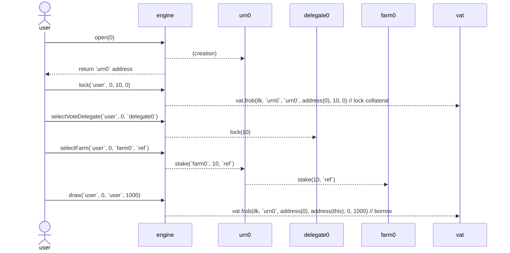

# Lockstake Engine

A technical description of the components of the LockStake Engine (LSE).

## 1. LockstakeEngine

The LockstakeEngine is the main contract in the set of contracts that implement and support the LSE. On a high level, it supports locking SKY in the contract, and using it to:
* Vote through a delegate contract.
* Farm USDS or SDAO tokens.
* Borrow USDS through a vault.

When withdrawing back the SKY the user has to pay an exit fee.

**System Attributes:**

* A single user address can open multiple positions (each denoted as `urn`).
* Each `urn` relates to zero or one chosen delegate contract, zero or one chosen farm, and one vault.
* SKY cannot be moved outside of an `urn` or between `urn`s without paying the exit fee.
* At any time the `urn`'s entire locked SKY amount is either staked or not, and is either delegated or not.
* Staking rewards are not part of the collateral, and are still claimable after freeing from the engine, changing a farm or being liquidated.
* The entire locked SKY amount is also credited as collateral for the user. However, the user itself decides if and how much USDS to borrow, and should be aware of liquidation risk.
* A user can delegate control of an `urn` that it controls to another EOA/contract. This is helpful for supporting manager-type contracts that can be built on top of the engine.
* Once a vault goes into liquidation, its SKY is undelegated and unstaked. It and can only be re-delegated or re-staked once there are no more auctions for it.

**User Functions:**

* `open(uint256 index)` - Create a new `urn` for the sender. The `index` parameter specifies how many `urn`s have been created so far by the user (should be 0 for the first call). It is used to avoid race conditions.
* `hope(address owner, uint256 index, address usr)` - Allow `usr` to also manage the `owner-index` `urn`.
* `nope(address owner, uint256 index, address usr)` - Disallow `usr` from managing the `owner-index` `urn`.
* `lock(address owner, uint256 index, uint256 wad, uint16 ref)` - Deposit `wad` amount of SKY into the `owner-index` `urn`. This also delegates the SKY to the chosen delegate (if such exists) and stakes it to the chosen farm (if such exists) using the `ref` code.
* `free(address owner, uint256 index, address to, uint256 wad)` - Withdraw `wad` amount of SKY from the `owner-index` `urn` to the `to` address (which will receive it minus the exit fee). This will undelegate the requested amount of SKY (if a delegate was chosen) and unstake it (if a farm was chosen). It will require the user to pay down debt beforehand if needed.
* `freeNoFee(address owner, uint256 index, address to, uint256 wad)` - Withdraw `wad` amount of SKY from the `owner-index` `urn` to the `to` address without paying any fee. This will undelegate the requested amount of SKY (if a delegate was chosen) and unstake it (if a farm was chosen). It will require the user to pay down debt beforehand if needed. This function can only be called by an address which was both authorized on the contract by governance and for which the urn owner has called `hope`. It is useful for implementing a migration contract that will move the funds to another engine contract (if ever needed).
* `selectVoteDelegate(address owner, uint256 index, address voteDelegate)` - Choose which delegate contract to delegate the `owner-index` `urn`'s entire SKY amount to. In case it is `address(0)` the SKY will stay (or become) undelegated.
* `selectFarm(address owner, uint256 index, address farm, uint16 ref)` - Select which farm (from the whitelisted ones) to stake the `owner-index` `urn`'s SKY to (along with the `ref` code). In case it is `address(0)` the SKY will stay (or become) unstaked.
* `draw(address owner, uint256 index, address to, uint256 wad)` - Generate `wad` amount of USDS using the `owner-index` `urn`’s SKY as collateral and send it to the `to` address.
* `wipe(address owner, uint256 index, uint256 wad)` - Repay `wad` amount of USDS backed by the `owner-index` `urn`’s SKY.
* `wipeAll(address owner, uint256 index)` - Repay the amount of USDS that is needed to wipe the `owner-index` `urn`’s entire debt.
* `getReward(address owner, uint256 index, address farm, address to)` - Claim the reward generated from a farm on behalf of the `owner-index` `urn` and send it to the specified `to` address.
* `multicall(bytes[] calldata data)` - Batch multiple methods in a single call to the contract.

**Sequence Diagram:**

Below is a diagram of a typical user sequence for winding up an LSE position.

For simplicity it does not include all external messages, internal operations or token interactions.

**Multicall:**

LockstakeEngine implements a function, which allows batching several function calls.

For example, a typical flow for a user (or an app/front-end) would be to first query `index=ownerUrnsCount(usr)` off-chain to retrieve the expected `index`, then use it to perform a multicall sequence that includes `open`, `selectFarm`, `lock` and `stake`.

This way, locking and farm-staking can be achieved in only 2 transactions (including the token approval).

Note that since the `index` is first fetched off-chain and there is no support for passing return values between batched calls, there could be race conditions for calling `open`. For example, `open` can be called twice by the user (e.g. in two different contexts) with the second `ownerUrnsCount` query happening before the first `open` call has been confirmed. This would lead to both calls using the same `urn` for `selectFarm`, `lock` and `stake`.

To mitigate this, the `index` parameter for `open` is used to make sure the multicall transaction creates the intended `urn`.

**Minimal Proxies:**

Upon calling `open`, an `urn` contract is deployed for each position. The `urn` contracts are controlled by the engine and represent each user position for farming, delegation and borrowing. This deployment process uses the [ERC-1167 minimal proxy pattern](https://eips.ethereum.org/EIPS/eip-1167), which helps reduce the `open` gas consumption by around 70%.

**Liquidation Callbacks:**

The following functions are called from the LockstakeClipper (see below) throughout the liquidation process.

* `onKick(address urn, uint256 wad)` - Undelegate and unstake the entire `urn`'s SKY amount. Users need to manually delegate and stake again if there are leftovers after liquidation finishes.
* `onTake(address urn, address who, uint256 wad)` - Transfer SKY to the liquidation auction buyer.
* `onRemove(address urn, uint256 sold, uint256 left)` - Burn a proportional amount of the SKY which was bought in the auction and return the rest to the `urn`.

**Configurable Parameters:**

* `farms` - Whitelisted set of farms to choose from.
* `jug` - The Dai lending rate calculation module.
* `fee` - Exit fee.

## 2. LockstakeClipper

A modified version of the Liquidations 2.0 Clipper contract, which uses specific callbacks to the LockstakeEngine on certain events and callbacks to a Cuttee contract to account for bad debt generation. This follows the same paradigm which was introduced in [proxy-manager-clipper](https://github.com/makerdao/proxy-manager-clipper/blob/67b7b5661c01bb09d771803a2be48f0455cd3bd3/src/ProxyManagerClipper.sol) (used for [dss-crop-join](https://github.com/makerdao/dss-crop-join)).

Specifically, the LockstakeEngine is called upon a beginning of an auction (`onKick`), a sell of collateral (`onTake`), and when the auction is concluded (`onRemove`).
The Cuttee is also called upon a beginning of an auction (`drip`) and when a sell of collateral concludes with part of the original debt not being recovered (`cut`).

The LSE liquidation process differs from the usual liquidations by the fact that it sends the taker callee the collateral (SKY) in the form of ERC20 tokens and not `vat.gem`.

**Due concept**
The LSE liquidation also brings a new value per auction called `due` and a global one called `Due`.
`due` tracks the real original debt of a liquidation (`tab` minus penalty fee) and `Due` is the global accumulator for all of the current ongoing auctions.

**Exit Fee on Liquidation**

For a liquidated position the relative exit fee is burned from the SKY (collateral) leftovers upon completion of the auction. To ensure enough SKY is left, and also prevent incentives for self-liquidation, the ilk's liquidation ratio (`mat`) must be set high enough. We calculate below the minimal `mat` (while ignoring parameters resolution for simplicity):

To be able to liquidate we need the vault to be liquidate-able. The point where that happens is:
`① ink * price / mat = debt`

The debt to be auctioned is enlarged (by the penalty) to `debt * chop` (where typically `chop` is 113%). If we assume the auction selling is at market price and that the market price didn't move since the auction trigger, then the amount of collateral sold is:
`debt * chop / price`

Since we need to make sure that only up to `(1-fee)` of the total collateral is sold (where `fee` will typically be 15%), we require:
`② debt * chop / price < (1-fee) * ink`

From ① and ② we get the requirement on `mat`:
`mat > chop / (1 - fee)`

For the mentioned examples of `chop` and `fee` we get:
`mat > 1.13 / 0.85 ~= 133%`

Note that in practice the `mat` value is expected to be significantly larger and have buffers over this rough calculation.
It should take into account market fluctuations and protocol safety, especially considering that the governance token is used as collateral.

**Trusted Farms and Reward Tokens**

It is assumed that the farm owner is trusted, the reward token implementation is non-malicious, and that the reward token minter/s are not malicious. Therefore, theoretic attacks, in which for example the reward rate is inflated to a point where the farm mechanics block liquidations, are assumed non-feasible.

**Liquidation Bark Gas Benchmarks**

Delegate: N, Staking: N - 483456 gas
Delegate: Y, Staking: Y, Yays: 1 - 614201 gas
Delegate: Y, Staking: Y, Yays: 5 - 646481 gas
Measured on: https://github.com/makerdao/lockstake/commit/a9c7a3e16f1655bdb60f75253d986a9e70a61e51

For reference, a regular collateral bark cost is around 450K.  
Source: https://docs.google.com/spreadsheets/d/1ifb9ePno6KHNNGQA8s6u8KG7BRWa7fhUYH3Z5JGOxag/edit#gid=0

Note that the increased gas cost should be taken into consideration when determining liquidation incentives, along with the dust amount.

**Configurable Parameters (similar to a regular Clipper):**

* `dog` - Liquidation module.
* `vow` - Recipient of DAI raised in auctions.
* `spotter` - Collateral price module.
* `calc` - Current price calculator.
* `buf` - Multiplicative factor to increase starting price.
* `tail` - Time elapsed before auction reset.
* `cusp` - Percentage drop before auction reset.
* `chip` - Percentage of tab to suck from vow to incentivize keepers.
* `tip` - Flat fee to suck from vow to incentivize keepers.
* `stopped` - Level used to disable various types of functionality.
* `chost` - Cached value of the ilk dust times the ilk chop. Set through `upchost()`.

## 3. Vote Delegation
### 3.a. VoteDelegate

The LSE integrates with [VoteDelegate v3](https://github.com/makerdao/vote-delegate/commits/ca1f2fb9b85ca2f3d89dc200766139c1613809ca) contract.
* This version removes the on-demand window function, that exists in the previous one, as the flash loan protection has been upgraded in the new Chief version.

### 3.b. VoteDelegateFactory

Since the VoteDelegate code is being modified (as described above), the factory also needs to be re-deployed.

Note that it is important for the LSE to only allow using VoteDelegate contracts from the factory, so it can be made sure that liquidations can not be blocked.

## 4. Keepers Support

In general participating in SKY liquidations should be pretty straightforward using the existing on-chain liquidity. However there is a small caveat:

Current Makerdao ecosystem keepers expect receiving collateral in the form of `vat.gem` (usually to a keeper arbitrage callee contract), which they then need to `exit` to ERC20 from. However the LSE liquidation mechanism sends the SKY directly in the form of ERC20, which requires a slight change in the keepers mode of operation.

For example, keepers using the Maker supplied [exchange-callee for Uniswap V2](https://github.com/makerdao/exchange-callees/blob/3b080ecd4169fe09a59be51e2f85ddcea3242461/src/UniswapV2Callee.sol#L109) would need to use a version that gets the `gem` instead of the `gemJoin` and does not call `gemJoin.exit`.

## 5. Splitter

The Splitter contract is in charge of distributing the Surplus Buffer funds on each `vow.flap` to the Smart Burn Engine (SBE) and the LSE's USDS farm. The total amount sent each time is `vow.bump`.

To accomplish this, it exposes a `kick` operation to be triggered periodically. Its logic withdraws DAI from the `vow` and splits it in two parts. The first part (`burn`) is sent to the underlying `flapper` contract to be processed by the SBE. The second part (`WAD - burn`) is distributed as reward to a `farm` contract. Note that `burn == 1 WAD` indicates funneling 100% of the DAI to the SBE without sending any rewards to the farm.

When sending DAI to the farm, the splitter also calls `farm.notifyRewardAmount` to update the farm contract on the new rewards distribution. This resets the farming distribution period to the governance configured duration and sets the rewards rate according to the sent reward amount and rewards leftovers from the previous distribution (in case there are any).

The Splitter implements rate-limiting using a `hop` parameter.

**Configurable Parameters:**
* `flapper` - The underlying burner strategy (e.g. the address of `FlapperUniV2SwapOnly`).
* `burn` - The percentage of the `vow.bump` to be moved to the underlying `flapper`. For example, a value of 0.70 \* `WAD` corresponds to a funneling 70% of the DAI to the burn engine.
* `hop` - Minimal time between kicks.

## 6. StakingRewards

The LSE uses a Maker modified [version](https://github.com/makerdao/endgame-toolkit/blob/master/README.md#stakingrewards) of the Synthetix Staking Reward as the farm for distributing USDS to stakers.

For compatibility with the SBE, the assumption is that the duration of each farming distribution (`farm.rewardsDuration`) is similar to the flapper's cooldown period (`flap.hop`). This in practice divides the overall farming reward distribution to a set of smaller non overlapping distributions. It also allows for periods where there is no distribution at all.

The StakingRewards contract `setRewardsDuration` function was modified to enable governance to change the farming distribution duration even if the previous distribution has not finished. This now supports changing it simultaneously with the SBE cooldown period (through a governance spell).

**Configurable Parameters:**
* `rewardsDistribution` - The address which is allowed to start a rewards distribution. Will be set to the splitter.
* `rewardsDuration` - The amount of seconds each distribution should take.

## 7. LockstakeMigrator

A contract which has the purpose to move `urn`s from a deprecated Lockstake version to a newer one, without having to pay the `exit` fee which would be required if the user would want to do this manually via the regular functions.
This contract uses the `LockstakeEngine.freeNoFee` function ensuring the collateral will still remain locked in a `LockstakeEngine`.
The migrator requires to be added to the `wards` mapping of the old `LockstakeEngine` and to the `wards` mapping of the `Vat`.

There are two paths that the user could take when calling the `migrate` function for the desired `urn`:
- If the `urn` doesn't have any debt. This is the simplest path where the collateral is just `free`d from the old engine and `lock`ed in the new one.
- If the `urn` has debt. This path uses the `DssFlash` module to `wipe` the debt in the old `urn` to be able to move the collateral. After doing so, the debt will be `draw`n in the new `urn` and the funds will be returned to the `DssFlash` module (all happens atomically).

The first path requires the migrator to be `hope`d in the old Engine for the `urn` being migrated. An authed address needs to call this `hope` function previously. It is also required that the caller of `migrate` be an authed address in the `urn` being migrated and in the recipient one.
For the second path, apart from the same requirements of the simplest one, it is also necessary that an authed address in the `urn` that is receiving the position in the new Lockstake has `hope`d the migrator.

Note: The caller authed requirement for the recipient `urn` in the first path is just an extra safety measure to avoid migrating collateral to an undesired `urn`. However for the second path it is indeed mandatory as migrating debt increases the debt of the recipient `urn`.

Note 2: Even though migrating debt manually outside the migrator is not supported, it is not guaranteed that a migrate call would not revert. It depends on governance parameters such as liquidation ratios and dust, and the system state such as whether a position is under liquidation or should use the `reserveHatch` mechanism. Governance is assumed to configure the parameters in a user-friendly way. The user is of course assumed to be aware of the parameters (for example if after migrating they become closer to liquidation).

Note 3: It is assumed that the debt of the old engine does not exceed the amount filed in onVatDaiFlashLoan prior to the migrator being enabled, and that governance do not change the old ilk line from 0 throughout the process.

Note 4: It is assumed that after a certain period the migrator's permission over the `Vat` will be removed, and the debt ceiling will be managed as usual using the autoline.

Note 5: Migration won't transfer the `VoteDelegate` nor the farm selected in the old `urn` to the destination one. This needs to be manually done by an `urn` authed user directly in the new Engine (before or after the migration).

Note 6: Migrator assumes `MkrSky` is configured without a penalty. So as soon as, the penalty is set above 0, the migrator will generally stop working. It also expects MKR to SKY conversions are not blocked.

## 8. LockstakeCappedOsmWrapper

A wrapper for the `PIP_SKY` Osm, which returns the minimum value between the current Osm price and a `cap` set in the wrapper.
This simple wrapper is encouraged to be used with liquidations off, or otherwise with extreme caution on params setting and risk management. If liquidations are activated using this simple wrapper and without further modifications, auctions can be triggered with a price that could be lower than the current Osm value. The same applies for the initial auction price (however here `clipper.buf` helps to mitigate the issue to some extend).

Notes:

- Vault owners should be aware that in such a situation they may recover less collateral in a liquidation.

- Vault owners are expected to be aware of the under-pricing of this oracle, which may bring them closer to liquidation for a certain amount of debt.

- Any change to the `cap` might have immediate effects in the `cur` and `nxt` prices. Third parties implementing this functionality need to be aware of this.

- If `cap` is lowered during an auction process it can cause `clipper.redo` to re-start an auction at a lower price (which would happen also if the price dropped, but here it's not organic). Vault owners should be aware of this risk.

The osm will be replaced by the wrapper in the `spotter` and `ilkRegistry`. The other modules, `end`, `clipper` and `clipper-mom` read the `pip` from the `spotter`, so they will inherit the change directly from there. However, it is still necessary doing the whitelisting to be able to read the price from the different sources.
`OsmMom` will still operate calling directly the source osm.

Note that the `end` flow is not assumed to be used as is, and if needed as part of an orchestrated-shutdown it will be re-examined holistically, including the effects of using the capped oracle.

## General Notes
* The LSE assumes that the ESM threshold is set large enough prior to its deployment, so Emergency Shutdown can never be called.
* Freeing very small amounts could bypass the exit fees (due to the rounding down) but since the LSE is meant to only be deployed on Ethereum, this is assumed to not be economically viable.
* As opposed to other collateral types, if a user notices an upcoming governance action that can hurt their position (or that they just don't like), they can not exit their position without losing the exit fee.
