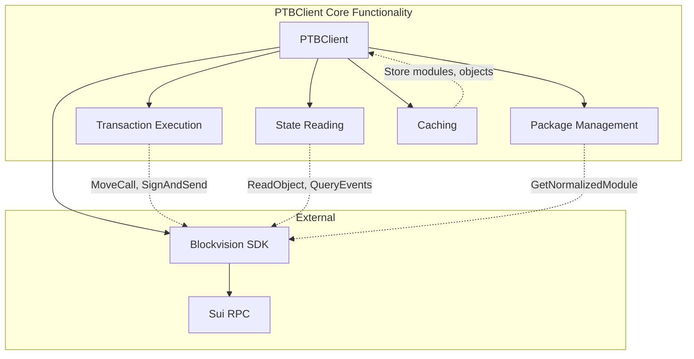

# PTB Client

The PTB (Programmable Transaction Block) Client is the core component responsible for interacting with the Sui blockchain in the Chainlink-Sui relayer. It provides a comprehensive interface for executing transactions, reading blockchain state, managing gas payments, and handling Move function calls.

## Overview

The `PTBClient` implements the `SuiPTBClient` interface and serves as the primary gateway for all Sui blockchain operations. It wraps the blockvision Sui SDK and provides additional functionality specific to Chainlink's needs.

### Core Capabilities

- **Transaction Management**: Creating, signing, and executing Programmable Transaction Blocks with comprehensive error handling and retry logic
- **State Reading**: Querying blockchain objects, events, and transaction status with intelligent filtering and pagination
- **Gas Management**: Estimating gas costs, managing gas payments, and optimizing coin selection for transactions
- **Caching System**: Multi-layer caching with configurable expiration for normalized modules, objects, and package metadata
- **Rate Limiting**: Semaphore-based concurrent request limiting with configurable thresholds and timeout protection
- **Package Management**: Advanced package upgrade detection, version tracking, and ABI-like module introspection

## Architecture



## Core Components

### 1. Transaction Management System

The transaction management system provides comprehensive transaction lifecycle handling:

**Features:**
- **Programmable Transaction Blocks (PTB)**: Native support for Sui's PTB format with complex transaction chaining
- **Transaction Signing**: Secure integration with keystore service for transaction signing
- **Execution Modes**: Support for different execution modes (wait for local execution, wait for effects, etc.)
- **Batch Processing**: Efficient batch submission of multiple transactions
- **Gas Estimation**: Accurate gas cost calculation before transaction execution

**Implementation Details:**
- Uses blockvision SDK as the underlying RPC client
- Implements retry logic with exponential backoff for failed transactions
- Supports both simple transactions and complex multi-step PTBs
- Automatic gas coin selection and management

### 2. State Reading Engine

Advanced blockchain state querying with intelligent filtering and caching:

**Capabilities:**
- **Object Queries**: Fetch specific objects by ID with type validation
- **Ownership Queries**: Retrieve all objects owned by an address with filtering
- **Event Monitoring**: Search and filter events with cursor-based pagination
- **Transaction History**: Query transaction history with flexible filtering options
- **Read-Only Execution**: Execute Move functions without state changes (dev inspect)

**Performance Optimizations:**
- Intelligent caching of frequently accessed objects
- Batch query optimization for multiple object requests
- Cursor-based pagination for large result sets
- Configurable query timeouts and retry mechanisms

### 3. Package Management System

Sophisticated package and module management with upgrade detection:

**Core Features:**
- **Module Introspection**: Fetch normalized Move module definitions (ABI-like functionality)
- **Version Tracking**: Track all package versions for a given module across upgrades
- **Upgrade Detection**: Automatically detect and handle package upgrades
- **CCIP Integration**: Specialized handling for CCIP package identification

**Technical Implementation:**
- Caches normalized modules to avoid repeated RPC calls
- Maintains package version history for upgrade compatibility
- Provides type-safe access to Move function signatures and parameters
- Supports both original and upgraded package resolution

### 4. Caching System

Multi-layer caching system designed for optimal performance:

**Cache Layers:**
- **Module Cache**: Long-term caching of normalized Move modules (rarely change)
- **Object Cache**: Short-term caching of frequently accessed objects with TTL
- **Package Metadata Cache**: Session-based caching of package version information
- **Query Result Cache**: Temporary caching of expensive query results

**Configuration:**
- Default expiration: 120 minutes for most cached data
- Cleanup interval: 240 minutes for expired entries
- Memory-efficient LRU eviction for large datasets
- Configurable cache sizes and expiration policies

### 5. Rate Limiting and Concurrency Control

Advanced rate limiting system to prevent RPC overload and ensure stability:

**Implementation:**
- **Semaphore-based Control**: Weighted semaphore limiting concurrent requests
- **Configurable Limits**: Default 100 concurrent requests, adjustable per instance
- **Request Queuing**: Intelligent queuing of requests during high load
- **Timeout Protection**: Configurable timeouts for all operations

**Benefits:**
- Prevents RPC node overload and potential bans
- Ensures fair resource allocation across different operation types
- Provides backpressure mechanism for high-throughput scenarios
- Maintains system stability under varying load conditions

## Configuration

### Client Initialization

```go
client, err := client.NewPTBClient(
    logger,                    // Logger instance
    "https://sui-rpc-url",    // RPC endpoint URL
    &maxRetries,              // Max retry attempts
    30*time.Second,           // Transaction timeout
    keystoreService,          // Keystore for signing
    100,                      // Max concurrent requests
    client.TransactionRequestTypeWaitForLocalExecution,
)
```

### Configuration Parameters

| Parameter | Type | Default | Description |
|-----------|------|---------|-------------|
| `maxRetries` | `*int` | - | Maximum retry attempts for failed operations |
| `transactionTimeout` | `time.Duration` | - | Timeout for transaction operations |
| `maxConcurrentRequests` | `int64` | 100 | Maximum concurrent RPC requests |
| `defaultRequestType` | `TransactionRequestType` | - | Default execution mode for transactions |

### Constants

```go
const (
    DefaultGasPrice             = 10_000        // 10K MIST
    DefaultGasBudget           = 1_000_000_000  // 1 SUI
    DefaultCacheExpiration     = 120 * time.Minute
    DefaultCacheCleanupInterval = 240 * time.Minute
    DefaultHTTPTimeout         = 15 * time.Second
)
```

## Move Function Execution

The PTB Client provides comprehensive support for executing Move functions on the Sui blockchain through various methods optimized for different use cases.

### MoveCall Method

The `MoveCall` method is the primary interface for executing Move functions and generating transaction bytes:

**Purpose**: Execute Move function calls on deployed packages and return transaction metadata for signing and submission.

**Key Features**:
- Type-safe argument handling with automatic serialization
- Gas estimation and budget management
- Support for generic type arguments
- Comprehensive error handling and validation

**Usage Pattern**:
```go
req := client.MoveCallRequest{
    Signer:          signerAddress,
    PackageObjectId: packageId,
    Module:          "ccip",
    Function:        "execute_message",
    Arguments:       args,
    GasBudget:       1000000000,
}
metadata, err := ptbClient.MoveCall(ctx, req)
```

### Integration with PTB Construction

MoveCall integrates seamlessly with Programmable Transaction Block construction:

```go
ptb := transaction.NewTransaction()
ptb.MoveCall(packageId, "ccip", "execute_message", typeArgs, args)
```

## Core API Methods

### Transaction Methods

#### SignAndSendTransaction
Sign and execute a transaction in one operation:

```go
response, err := ptbClient.SignAndSendTransaction(ctx, txBytes, signerPublicKey, requestType)
```

### State Reading Methods

#### ReadFunction
Execute read-only function calls (dev inspect):
```go
results, err := ptbClient.ReadFunction(ctx, signer, pkg, "ccip", "get_status", []any{messageId}, []string{"vector<u8>"})
```

#### ReadObjectId
Fetch specific object data by ID:
```go
objectData, err := ptbClient.ReadObjectId(ctx, objectId)
```

#### QueryEvents
Search for events with filtering:
```go
filter := client.EventFilterByMoveEventModule{Package: packageId, Module: "ccip", Event: "MessageExecuted"}
events, err := ptbClient.QueryEvents(ctx, filter, &limit, cursor, sortOptions)
```

### Package Management Methods

#### GetNormalizedModule
Fetch Move module definitions (ABI-like):
```go
normalizedModule, err := ptbClient.GetNormalizedModule(ctx, packageId, "ccip")
```

#### LoadModulePackageIds
Track all package versions for a module:
```go
packageIds, err := ptbClient.LoadModulePackageIds(ctx, originalPackageId, "ccip", signerAddress)
```

### Utility Methods

#### EstimateGas
Calculate gas requirements before execution:
```go
gasEstimate, err := ptbClient.EstimateGas(ctx, txBytes)
```

#### GetSUIBalance
Check SUI balance for gas payments:
```go
balance, err := ptbClient.GetSUIBalance(ctx, address)
```

## Integration with Transaction Manager

The PTB Client integrates seamlessly with the Transaction Manager (TxM) system for comprehensive transaction lifecycle management.

### Transaction Flow

1. **Enqueue**: TxM creates PTB and calls `EnqueuePTB`
2. **Generation**: PTB Client prepares transaction with gas estimation
3. **Signing**: Transaction is signed using the keystore service
4. **Broadcasting**: Signed transaction is submitted to the network
5. **Confirmation**: Transaction status is monitored until confirmation

### Integration Pattern

```go
// Create and configure PTB
ptb := transaction.NewTransaction()
ptb.SetSender(signerAddress)
ptb.SetGasBudget(gasBudget)

// Enqueue through TxM
suiTx, err := txm.EnqueuePTB(ctx, transactionId, txMetadata, signerPublicKey, ptb)
```

## Error Handling

The PTB Client implements comprehensive error handling:

### Common Error Types

- **RPC Errors**: Network connectivity, node availability
- **Transaction Errors**: Invalid transactions, insufficient gas
- **Signing Errors**: Keystore unavailability, invalid keys
- **Rate Limit Errors**: Too many concurrent requests
- **Cache Errors**: Memory issues, expired data

### Error Patterns

```go
// Check for specific error types
if strings.Contains(err.Error(), "insufficient funds") {
    // Handle insufficient gas
} else if strings.Contains(err.Error(), "rate limit") {
    // Handle rate limiting
} else {
    // Handle general errors
}
```

## Performance Considerations

### Caching Strategy

- **Module Definitions**: Cached indefinitely (rarely change)
- **Object State**: Cached with expiration (may change frequently)
- **Package IDs**: Cached per session (upgrade detection)

### Rate Limiting

- **Concurrent Requests**: Limited to prevent RPC overload
- **Request Batching**: Batch similar operations when possible
- **Retry Logic**: Exponential backoff for failed requests

### Gas Optimization

- **Gas Estimation**: Always estimate before execution
- **Coin Selection**: Optimize coin selection for gas payments
- **Budget Management**: Monitor and adjust gas budgets

## Best Practices

### 1. Connection Management

```go
// Use appropriate timeouts
ctx, cancel := context.WithTimeout(context.Background(), 30*time.Second)
defer cancel()

// Configure reasonable concurrent request limits
maxConcurrentRequests := 50 // Adjust based on RPC capacity
```

### 2. Error Handling

```go
// Always check for specific error conditions
if err != nil {
    if strings.Contains(err.Error(), "object not found") {
        // Handle missing object
        return handleMissingObject(objectId)
    }
    return fmt.Errorf("unexpected error: %w", err)
}
```

### 3. Gas Management

```go
// Always estimate gas before execution
gasEstimate, err := client.EstimateGas(ctx, txBytes)
if err != nil {
    return fmt.Errorf("gas estimation failed: %w", err)
}

// Add buffer for gas estimation
gasBudget := gasEstimate + (gasEstimate * 10 / 100) // 10% buffer
```

### 4. Caching Usage

```go
// Check cache before expensive operations
if cachedValue, found := client.GetCachedValue(cacheKey); found {
    return cachedValue, nil
}

// Cache results of expensive operations
result, err := expensiveOperation()
if err == nil {
    client.SetCachedValue(cacheKey, result)
}
```

## Troubleshooting

### Common Issues

1. **RPC Timeouts**: Increase timeout values or reduce concurrent requests
2. **Gas Estimation Failures**: Check transaction validity and object availability
3. **Cache Misses**: Verify cache configuration and expiration settings
4. **Rate Limiting**: Reduce concurrent request limits or implement backoff

### Debug Logging

Enable debug logging to troubleshoot issues:

```go
// The PTB Client logs extensively at debug level
logger := logger.NewLogger(logger.DebugLevel)
```

### Monitoring

Key metrics to monitor:

- **RPC Response Times**: Track RPC call latencies
- **Error Rates**: Monitor failed requests by type
- **Cache Hit Rates**: Measure caching effectiveness
- **Gas Usage**: Track gas consumption patterns

## Usage Examples

### Basic Transaction Execution

```go
// Initialize client
ptbClient, err := client.NewPTBClient(logger, rpcURL, nil, 30*time.Second, keystore, 50, requestType)

// Execute Move function
req := client.MoveCallRequest{
    Signer: signerAddress, PackageObjectId: packageId, Module: "ccip", 
    Function: "execute_message", Arguments: args, GasBudget: 1000000000,
}
txMetadata, err := ptbClient.MoveCall(ctx, req)

// Sign and send
response, err := ptbClient.SignAndSendTransaction(ctx, txMetadata.TxBytes, signerKey, requestType)
```

### PTB Construction

```go
// Create and configure PTB
ptb := transaction.NewTransaction()
ptb.SetSender(signerAddress)
ptb.SetGasBudget(30_000_000)

// Chain multiple operations
counterResult := ptb.MoveCall(packageId, "counter", "get_count", typeArgs, []transaction.Argument{ptb.Object(objectId)})
ptb.MoveCall(packageId, "counter", "increment_by", typeArgs, []transaction.Argument{ptb.Object(objectId), counterResult})
ptb.TransferObjects([]transaction.Argument{ptb.Object(tokenId)}, ptb.Pure(recipient))

// Execute PTB
response, err := ptbClient.FinishPTBAndSend(ctx, signer, ptb, requestType)
```

### State Reading

```go
// Read object data
objectData, err := ptbClient.ReadObjectId(ctx, objectId)

// Execute read-only function
results, err := ptbClient.ReadFunction(ctx, signer, pkg, "ccip", "get_status", []any{messageId}, []string{"vector<u8>"})

// Query events with filtering
filter := client.EventFilterByMoveEventModule{Package: packageId, Module: "ccip", Event: "MessageExecuted"}
events, err := ptbClient.QueryEvents(ctx, filter, &limit, nil, nil)

// Get owned objects by type
ownedObjects, err := ptbClient.ReadFilterOwnedObjectIds(ctx, owner, "0x123::token::Token", &limit)
```

### Gas Management

```go
// Check balance before transaction
balance, err := ptbClient.GetSUIBalance(ctx, signerAddress)
if balance.Cmp(requiredGas) < 0 {
    return fmt.Errorf("insufficient balance")
}

// Estimate gas and add buffer
gasEstimate, err := ptbClient.EstimateGas(ctx, txBytes)
gasBudget := gasEstimate + (gasEstimate * 20 / 100) // 20% buffer

coins, err := ptbClient.GetCoinsByAddress(ctx, signerAddress)
```

### Package Management

```go
// Get all package versions for a module
packageIds, err := ptbClient.LoadModulePackageIds(ctx, originalPackageId, "ccip", signerAddress)

// Get the latest package ID
latestPackageId, err := ptbClient.GetLatestPackageId(ctx, originalPackageId, "ccip", signerAddress)

// Get normalized module definition (ABI-like)
normalizedModule, err := ptbClient.GetNormalizedModule(ctx, latestPackageId, "ccip")

// Get CCIP-specific package ID
ccipPackageId, err := ptbClient.GetCCIPPackageID(ctx, offrampPackageId, signerAddress)
```

### Event Monitoring

```go
// Query recent transactions
limit := uint64(10)
txResponse, err := ptbClient.QueryTransactions(ctx, fromAddress, nil, &limit)

// Check transaction status
status, err := ptbClient.GetTransactionStatus(ctx, txDigest)

// Monitor events with cursor-based pagination
filter := client.EventFilterByMoveEventModule{Package: packageId, Module: "ccip", Event: "MessageExecuted"}
events, err := ptbClient.QueryEvents(ctx, filter, &eventLimit, cursor, sortOptions)
```

### Caching and Performance

```go
// Check cache before expensive operations
if cachedValue, found := ptbClient.GetCachedValue(cacheKey); found {
    return cachedValue, nil
}

// Cache results of expensive operations
result, err := ptbClient.LoadModulePackageIds(ctx, packageId, "ccip", signerAddress)
if err == nil {
    ptbClient.SetCachedValue(cacheKey, result)
}

// Batch cache operations
cacheData := map[string]any{"latest_package_id": latestId, "package_count": count}
ptbClient.SetCachedValues(cacheData)
```

### Error Handling and Retry

```go
// Implement retry logic with exponential backoff
for attempt := 0; attempt < maxRetries; attempt++ {
    objectData, err := ptbClient.ReadObjectId(ctx, objectId)
    if err == nil {
        return objectData, nil
    }
    
    // Check for retryable errors
    if strings.Contains(err.Error(), "timeout") || strings.Contains(err.Error(), "rate limit") {
        time.Sleep(time.Duration(attempt+1) * baseDelay)
        continue
    }
    return nil, err // Non-retryable error
}
```

## Security Considerations

### Private Key Management

- **Keystore Integration**: All signing operations use the secure keystore service
- **No Key Exposure**: Private keys never leave the keystore
- **Signature Verification**: All signatures are verified before submission

### Transaction Safety

- **Gas Limits**: Always set appropriate gas limits to prevent runaway transactions
- **Simulation**: Simulate transactions before execution when possible
- **Validation**: Validate all input parameters before processing

### Network Security

- **HTTPS Only**: Always use HTTPS for RPC connections
- **Rate Limiting**: Implement rate limiting to prevent abuse
- **Timeout Protection**: Set reasonable timeouts for all operations
